# Arquitectura inicial de Academia Virtual

Revisión del entorno: **2026-10-06**, sobre el repositorio `academia-virtual` existente.
Esta es una vista inicial de **tres capas lógicas**
del MVP, no una implementación terminada ni tres servidores obligatorios. Se conserva
el monolito modular del [plan de identidad](../specs/001-identidad-acceso-roles/plan.md).

## Inventario y estado del repositorio

| Material revisado | Qué aporta | Estado que permite afirmar |
| --- | --- | --- |
| [README](../README.md) | Nombre, propósito, presupuesto y navegación. | Tenía referencias a una etapa sin código; se actualizan en esta entrega. |
| [Constitución 1.1.0](../.specify/memory/constitution.md) | Seguridad, precios, integridad, pagos, video, entornos, recuperación, capacidad y gobernanza. | Obligaciones del proyecto; no pruebas superadas. |
| [Alcance MVP](../docs/alcance-mvp.md) y [decisiones D01–D13](../docs/decisiones-pendientes.md) | Áreas funcionales, exclusiones, presupuesto e integraciones. | Fuente del alcance general. Su estado del 2026-09-23 es histórico; se añaden notas de vigencia sin sustituir reglas pendientes. |
| [Spec de identidad](../specs/001-identidad-acceso-roles/spec.md) y [checklist](../specs/001-identidad-acceso-roles/checklists/requirements.md) | 7 historias, 33 FR, 10 criterios de éxito, roles y flujos definidos. | Calidad documental revisada; sin historias implementadas. |
| [Plan](../specs/001-identidad-acceso-roles/plan.md) y [research](../specs/001-identidad-acceso-roles/research.md) | Monolito modular, sesiones opacas, correo persistido, decisiones R01–R12. | Diseño aprobado; Ejecución local mediante Docker Compose con PostgreSQL 16.14. |
| [Modelo de datos](../specs/001-identidad-acceso-roles/data-model.md), [API](../specs/001-identidad-acceso-roles/contracts/api.md) y [UI](../specs/001-identidad-acceso-roles/contracts/ui.md) | Entidades/invariantes, contratos HTTP y pantallas de identidad. | Diseños de destino; no tablas/endpoints/pantallas funcionales existentes. |
| [Quickstart](../specs/001-identidad-acceso-roles/quickstart.md), [verification](../specs/001-identidad-acceso-roles/verification.md) y [tasks](../specs/001-identidad-acceso-roles/tasks.md) | Procedimientos, V00/V01–V16, ensayos de carga y 108 tareas. | 10 tareas de entorno completadas T001–T010; 98 pendientes. Sin ejecución de carga ni aceptación funcional. |
| [Entorno Docker](../ops/docker/README.md), [verificación](../ops/docker/verification.md) y [compatibilidad](../ops/docker/compatibility.md) | Ejecución local y resultados del entorno. | Cuatro servicios Linux; auditoría de dependencias y aceptación funcional pendientes. |
| [T009: arquitectura](../ops/local/architecture.md) y [T010: pruebas](../ops/docker/test-harness.md) | Composición Nest, límites de importación y soporte de pruebas. | Límites y soporte conservados; resultados actuales en [verificación Docker](../ops/docker/verification.md). |
| [Código API](../apps/api/src/app.module.ts), [Probe](../apps/api/src/probe.module.ts) y [web](../apps/web/src/app/App.tsx) | AppModule ensambla Probe; `GET /health/live` devuelve estado; React muestra «En preparación». | Base técnica implementada. No login, cuentas, cursos, órdenes, pagos, matrícula, materiales, clases, chat ni paneles funcionales. |
| [Paquetes](../package.json), [API](../apps/api/package.json), [web](../apps/web/package.json) y [lockfile](../package-lock.json) | npm workspaces y dependencias reales de React/Vite, NestJS/TypeScript, Prisma/pg, Argon2 y Nodemailer; herramientas de pruebas. | Instalación y compatibilidad documentadas, no prueba de uso en funciones inexistentes. El [schema de ensayo](../ops/local/compatibility/prisma/schema.prisma) solo contiene CompatibilityProbe. |
| [Compose](../compose.yml), [procedimiento](../ops/docker/README.md) y [workflow](../.github/workflows/v00-linux.yml) | PostgreSQL, Mailpit, API y web como entorno principal. | Validación local según evidencia; no ejecución remota de CI ni integración de video. |

El estado del entorno se mantiene en [verificación Docker](../ops/docker/verification.md).
La vista de capas y los módulos de negocio no cambian por el empaquetado local.

## Decisiones vigentes y discrepancias resueltas

Para alcance y obligaciones se conservan constitución/especificación; para entorno y
estado se usa la actualización fechada más reciente respaldada por código/evidencia.
Una lista de tareas futuras no cuenta como implementación.

| Diferencia encontrada | Decisión usada y fundamento |
| --- | --- |
| README/alcance indicaban que no había aplicación ni scripts; ahora existen workspaces y pruebas. | Hay esqueleto técnico y herramientas verificadas, pero no funciones de negocio. Código y evidencia T009/T010 del 2026-09-29 prevalecen para estado. |
| Entorno de ejecución | Docker Compose con PostgreSQL 16.14, Mailpit y aplicaciones Linux. El procedimiento y los resultados se mantienen en ops/docker/. No cambia el diseño de negocio. |
| D11/checklist dicen «lista para planificar», pero ya hay plan y tareas. | Comportamiento y diseño de identidad definidos; fundamentos T003–T010 completados, historias aún pendientes. Se preserva el registro histórico y se aclara en docs/README. |
| Estado de tareas de entorno | T001–T010 completadas según la evidencia local; las historias y el resto de T030 siguen pendientes. |
| Culqi aparece como candidata histórica. | Izipay elegida desde 2026-09-23 según D02 y constitución; sin integración. La regla de un pago por orden sigue pendiente independiente de la pasarela. |
| Plan describe entradas/aplicación/dominio/infraestructura; la vista general muestra tres capas. | Son niveles de detalle compatibles: presentación = web/entradas; negocio = aplicación/dominio; datos = persistencia. Adaptadores externos quedan en el límite del módulo que los usa; no son una cuarta capa de negocio ni parten de PostgreSQL. |

## Vista propuesta de tres capas

Los módulos y conexiones siguientes describen el **diseño previsto del MVP**. Solo
existen el esqueleto web/API, el ensayo PostgreSQL/Mailpit y los controles de estructura
indicados arriba; no se presenta este diagrama como vista de funcionalidades desplegadas.

```mermaid
flowchart TB
    alumno["Alumno / visitante"]
    docente["Docente"]
    admin["Administrador"]
    operador["Responsable del entorno"]

    subgraph presentacion["Capa 1 · Presentación y entradas"]
        web["Aplicación web · React / TypeScript / Vite"]
        api["API REST · entradas HTTP NestJS"]
        gateway["Entrada de chat · Socket.IO previsto"]
        cli["CLI operativa restringida · prevista"]
    end

    subgraph negocio["Capa 2 · Lógica de negocio · monolito modular NestJS"]
        identidad["Identidad y usuarios · acceso, cuentas, perfil e inicio"]
        permisos["Autorización · rol, propiedad y matrícula"]
        oferta["Oferta académica · cursos, grupos, horarios y cupos"]
        ordenes["Órdenes · precios, conceptos y total"]
        pagos["Pagos · verificación, idempotencia y adaptador Izipay"]
        matriculas["Matrículas · activación y consistencia de cupos"]
        materiales["Materiales · publicación y acceso"]
        clases["Clases y video · permisos y coordinación de medios"]
        chat["Chat · autorización y aislamiento por clase"]
        paneles["Paneles básicos · consultas por rol"]
        correo["Correo · entregas y adaptador SMTP"]
        auditoria["Auditoría · eventos permitidos sin secretos"]
    end

    subgraph datos["Capa 3 · Datos y persistencia"]
        persistencia["Adaptadores Prisma/pg · consultas, transacciones y restricciones"]
        bd[("PostgreSQL 16 · datos por entorno")]
        archivos["Almacenamiento de materiales · por definir D12"]
    end

    subgraph externos["Sistemas externos / infraestructura de medios prevista"]
        izipay["Izipay · integración pendiente"]
        smtp["SMTP de producción · proveedor pendiente"]
        mailpit["Mailpit · captura local comprobada"]
        obs["OBS del docente · previsto"]
        srs["SRS / HLS · distribución y autorización por validar"]
    end

    alumno --> web
    docente --> web
    admin --> web
    operador --> cli
    web -->|"HTTPS / JSON"| api
    web --> gateway
    cli --> identidad
    api --> identidad
    api --> permisos
    api --> oferta
    api --> ordenes
    api --> pagos
    api --> matriculas
    api --> materiales
    api --> clases
    api --> paneles
    gateway --> chat
    identidad --> permisos
    identidad --> correo
    identidad --> auditoria
    ordenes --> oferta
    pagos --> ordenes
    pagos --> matriculas
    matriculas --> oferta
    materiales --> permisos
    clases --> permisos
    chat --> permisos
    paneles --> permisos
    paneles --> oferta
    paneles --> matriculas
    identidad --> persistencia
    permisos --> persistencia
    oferta --> persistencia
    ordenes --> persistencia
    pagos --> persistencia
    matriculas --> persistencia
    materiales --> persistencia
    materiales --> archivos
    clases --> persistencia
    correo --> persistencia
    auditoria --> persistencia
    persistencia --> bd
    pagos <-->|"operación y confirmación verificada"| izipay
    correo -->|"SMTP futuro"| smtp
    correo -->|"SMTP local de prueba"| mailpit
    clases -.->|"contrato de autorización por definir"| srs
    docente --> obs
    obs -->|"emisión prevista"| srs
    srs -->|"HLS autorizado: manifiestos y segmentos"| web
```

Las flechas muestran colaboración/flujo lógico, no un grafo de imports de código.
Los accesos a integraciones nacen de pagos, correo y clases; la BD no invoca proveedores.
SMTP real y Mailpit son alternativas según el entorno. OBS y la entrega HLS representan
el tráfico de medios; **no se propone hacer circular segmentos por PostgreSQL ni por
la API REST**. La conexión clases–SRS señala un contrato por definir en D08, no una
integración disponible. El almacenamiento de materiales también sigue abierto.

## Responsabilidades y dependencias

| Capa | Responsabilidad | Dependencias y límites |
| --- | --- | --- |
| Presentación | Web por rol, formularios/reproductor; API REST adapta DTO, cookies y errores; gateway adapta chat; CLI restringida adapta operaciones locales. | Invoca casos de uso. No calcula el precio confiable, decide permisos finales ni consulta BD directamente. API REST se ubica aquí por su función de entrada aunque ejecute en el backend. |
| Lógica de negocio | Aplicación coordina casos de uso/transacciones; dominio contiene reglas puras de cuentas, permisos, precios, cupos, pago y acceso académico. | Consume contratos pequeños de persistencia y proveedores. Sin Request/Response, SQL, Prisma ni SMTP en las reglas. Los módulos colaboran por capacidades públicas; no importan internos ajenos ni crean ciclos. |
| Datos | Adaptadores implementan consultas, migraciones y transacciones sobre PostgreSQL; índices/restricciones preservan invariantes. Almacenamiento de materiales por decidir. | Implementa contratos del negocio. No autentica pagos ni orquesta SMTP/video; no devuelve modelos Prisma al navegador. Una BD por entorno, sin obligación de separar servidores. |

La dirección de imports conserva el plan: entrada → aplicación → dominio;
infraestructura → contratos de aplicación/dominio. En ejecución los casos de uso llaman
a los adaptadores inyectados; Nest los ensambla en la raíz de composición. El límite
de tres capas no obliga al negocio a importar una implementación de datos. Los
adaptadores Izipay/SMTP/medios pertenecen a la infraestructura de su módulo consumidor.

El incremento actual diseña `identity`, `users`, `authorization`, `mail` y `audit`.
Su [modelo](../specs/001-identidad-acceso-roles/data-model.md) prevé User, Session,
ActionToken, MailDelivery, RateBucket/RateEvent, AuditEvent y SystemState; ninguna de
esas entidades está aún migrada en la aplicación. Sesiones opacas en cookie HttpOnly,
Argon2id y entregas persistidas son decisiones de diseño; solo las bibliotecas/ensayos
auxiliares tienen evidencia. Los módulos académicos del gráfico pertenecen al MVP
posterior y todavía no tienen especificaciones equivalentes.

## Cobertura del análisis y pendientes

| Entregable | Material que ya cubría la necesidad | Organización añadida |
| --- | --- | --- |
| [Actores](../analisis-de-sistema/01-actores.md) | Roles de identidad y servicios del alcance/plan. | Catálogo humano/externo con necesidades, límites y estado. |
| [Historias](../analisis-de-sistema/02-historias-del-usuario.md) | Siete historias detalladas de identidad y áreas del MVP. | HU01–HU17 del conjunto del MVP con origen y propuestas explícitas. |
| [Requisitos funcionales](../analisis-de-sistema/03-requisitos-funcionales.md) | 33 FR de identidad, constitución y alcance académico. | RF01–RF19 de síntesis y matriz HU ↔ RF; preservación de FR originales. |
| [Calidad](../analisis-de-sistema/04-atributos-de-calidad.md) | Seguridad, operación y carga detalladas en constitución/verification. | AC01–AC07 como escenarios de estímulo, respuesta, medida y evidencia. |
| [Restricciones](../analisis-de-sistema/05-restricciones.md) | Plazo, presupuesto, stack, integraciones y exclusiones. | RT01–RT11 con estado vigente y fuente. |
| [Drivers](../analisis-de-sistema/06-driver-arquitectonicos.md) | Decisiones y principios arquitectónicos dispersos. | DA01–DA08 priorizados y trazados a RF/AC/RT. |
| Arquitectura inicial | Monolito modular y capas internas del plan de identidad. | Vista Mermaid de tres capas para el MVP, responsabilidades, integraciones, inventario y resolución de discrepancias. |

Permanecen abiertos D01–D10/D12–D13 según
[decisiones-pendientes.md](../docs/decisiones-pendientes.md): reglas de pago/reserva,
vigencia/reembolsos/horarios; condiciones de Izipay/Yape; video, permisos HLS y costo;
alojamiento; rúbrica y carga; materiales/paneles; objetivos y operación de recuperación.
D11 tiene comportamiento y diseño definidos, sin implementación funcional. La asignación
detallada de gestión académica/publicación también debe validarse al especificar esos módulos.
SMTP de producción y auditoría de dependencias siguen pendientes. Estos pendientes
no se convierten en reglas aprobadas mediante esta entrega documental.
