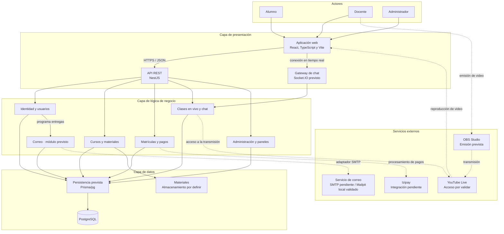

# Diagrama de arquitectura de Academia Virtual

## Descripción general

Academia Virtual emplea una arquitectura de tres capas: presentación, lógica de negocio y datos. Esta separación permite distribuir las responsabilidades del sistema, facilitar su mantenimiento y evitar que las interfaces de usuario accedan directamente a la base de datos.

La solución se plantea como un monolito por capas organizado en módulos. El frontend utiliza React, TypeScript y Vite, mientras que el backend emplea NestJS y expone una API REST. Los módulos se ejecutan dentro de una misma aplicación; Clean Architecture orienta sus dependencias internas según R01. La información se almacenará en PostgreSQL mediante adaptadores de persistencia.

El diagrama representa el **diseño previsto**, no funcionalidades ya desplegadas. La base web/API y el entorno PostgreSQL/Mailpit están comprobados; los módulos de negocio, el gateway de chat y los adaptadores funcionales siguen pendientes. Docker Compose organiza la ejecución local y no convierte los contenedores en microservicios.

## Diagrama de arquitectura

## Responsabilidades de las capas

| Capa | Responsabilidades | Restricciones |
|---|---|---|
| Presentación | Proporcionar las interfaces utilizadas por alumnos, docentes y administradores. Recibir solicitudes HTTP, validar datos de entrada y adaptar las respuestas del sistema. | No accede directamente a PostgreSQL ni implementa reglas de matrícula, pagos o autorización. |
| Lógica de negocio | Ejecutar los casos de uso relacionados con identidad, usuarios, cursos, materiales, matrículas, pagos, clases, chat y administración. | Las reglas del negocio permanecen separadas de HTTP, SQL y los detalles de los servicios externos. |
| Datos | Implementar la persistencia, las consultas, las migraciones y las transacciones requeridas por los módulos del sistema. | No decide permisos, estados de matrícula ni resultados de pagos. Implementa los contratos definidos por la lógica de negocio. |

## Módulos de negocio

| Módulo | Responsabilidad principal |
|---|---|
| Identidad y usuarios | Registro, verificación de correo, inicio y cierre de sesión, recuperación de contraseña, perfiles y administración de cuentas. |
| Cursos y materiales | Gestión de cursos, grupos, horarios, cupos y recursos académicos. |
| Matrículas y pagos | Creación de matrículas, cálculo de importes, confirmación de pagos y habilitación del acceso a los cursos. |
| Clases en vivo y chat | Control de acceso a las clases, publicación de enlaces y comunicación en tiempo real entre los participantes. |
| Administración y paneles | Gestión de usuarios, roles, cursos, matrículas y consultas correspondientes a cada tipo de usuario. |
| Correo | Entregas persistidas, reintentos y adaptación SMTP solicitados por identidad; implementación pendiente. |

Estos grupos resumen capacidades del MVP, no sustituyen los módulos detallados del plan de identidad ni crean unidades de despliegue independientes. La inicialización y recuperación del operador se describen en la arquitectura inicial y en el plan; no se representan como pantallas adicionales en esta vista.

## Servicios externos

| Servicio | Función dentro del sistema | Situación |
|---|---|---|
| Izipay | Procesar los pagos de las matrículas y comunicar el resultado de cada operación. | Servicio seleccionado; integración pendiente de implementación y validación. |
| Mailpit | Capturar los correos enviados durante el desarrollo y las pruebas locales. | Servicio local validado con Docker Compose; los flujos funcionales de correo siguen pendientes. |
| Servicio SMTP | Enviar correos de verificación y recuperación de contraseña en producción. | Proveedor pendiente de selección y configuración. |
| YouTube Live | Transmitir las clases en vivo y proporcionar el reproductor de video. | Elección DA03/DEC01 para el MVP con OBS; integración y compatibilidad con el control de acceso RF16 pendientes de validación. |
| OBS Studio | Permitir que el docente emita audio y video desde su computadora. | Herramienta prevista para la transmisión de las clases. |
| Almacenamiento de materiales | Conservar los archivos académicos publicados por los docentes. | Alternativa tecnológica pendiente de selección. |

## Dependencias

En el diseño previsto, la aplicación web se comunicará con la API REST mediante HTTP/JSON, con HTTPS en publicación, y utilizará una conexión en tiempo real para el chat. La API dirigirá cada solicitud al módulo de negocio correspondiente.

Los módulos utilizan contratos de persistencia para almacenar y consultar información. Los adaptadores implementan estos contratos mediante Prisma y PostgreSQL. De esta manera, las reglas del negocio no dependen directamente de una tecnología de base de datos.

Las integraciones externas se realizan desde el módulo que las necesita:

- Identidad y usuarios solicita entregas al módulo de correo, que utiliza su adaptador SMTP.
- Matrículas y pagos utiliza Izipay.
- Clases en vivo utiliza YouTube Live.
- El docente utiliza OBS Studio para emitir la transmisión.
- Cursos y materiales utiliza el almacenamiento de archivos.

PostgreSQL conserva los datos del sistema, pero no se comunica directamente con Izipay, el servicio de correo o YouTube.

## Estado de la arquitectura

El proyecto cuenta con la estructura inicial del frontend y la API: React muestra «En preparación» y NestJS compone ProbeModule para `GET /health/live`. PostgreSQL, Mailpit, API y web funcionan en el entorno local Docker Compose validado en el commit `47c8338`, según la [evidencia registrada](../ops/docker/verification.md). Los módulos funcionales se implementarán progresivamente de acuerdo con las historias y requisitos.

La capacidad para soportar 1000 usuarios concurrentes deberá comprobarse mediante pruebas de carga. Las integraciones con Izipay, correo de producción, YouTube Live y almacenamiento de materiales también requieren implementación y validación.

La protección de video exige comprobar acceso directo y permisos vencidos. Una página autenticada o un enlace oculto no demuestran ese control; la compatibilidad con las condiciones de RF16 permanece pendiente. La operación local tampoco demuestra disponibilidad de producción ni restauración de respaldos.

## Documentos relacionados

- [Actores del sistema](../analisis-de-sistema/01-actores.md)
- [Historias de usuario](../analisis-de-sistema/02-historias-del-usuario.md)
- [Requisitos funcionales](../analisis-de-sistema/03-requisitos-funcionales.md)
- [Atributos de calidad](../analisis-de-sistema/04-atributos-de-calidad.md)
- [Restricciones](../analisis-de-sistema/05-restricciones.md)
- [Drivers arquitectónicos](../analisis-de-sistema/06-driver-arquitectonicos.md)
- [Decisiones arquitectónicas](../analisis-de-sistema/07-decisiones-arquitectonicas.md)
- [Arquitectura inicial](arquitectura-inicial.md)
- [Estilo arquitectónico](estilo-arquitectonico.md)
- [Enfoque arquitectónico](enfoque-arquitectonico.md)
