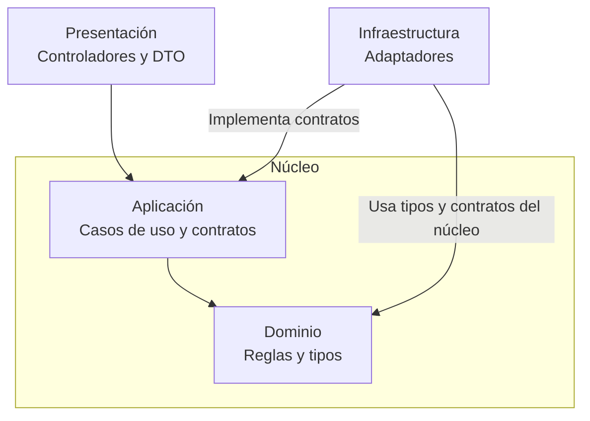

# Enfoque arquitectónico

Clean Architecture organiza las responsabilidades y dependencias internas de Academia Virtual. Complementa el [estilo monolítico por capas](estilo-arquitectonico.md): los módulos del backend permanecen dentro de una misma aplicación NestJS. Se conservan React/Vite, PostgreSQL y Docker Compose; el enfoque no exige cambiar esas tecnologías ni dividir el sistema en servicios independientes.

La elección responde a **DA07**, mantenibilidad y evolución modular, y a **R01**, estructura y dependencias internas, del [registro de decisiones arquitectónicas](../analisis-de-sistema/07-decisiones-arquitectonicas.md). Según los [drivers vigentes](../analisis-de-sistema/06-driver-arquitectonicos.md), modificar una funcionalidad debe afectar solo a los módulos necesarios. El [plan de identidad](../specs/001-identidad-acceso-roles/plan.md) concreta los límites que permiten mantener reglas de negocio independientes del transporte, la persistencia y los proveedores.

## Síntesis del enfoque

| Elemento | Descripción aplicada a Academia Virtual |
| --- | --- |
| Enfoque seleccionado | Clean Architecture dentro de los módulos del monolito NestJS. |
| Objetivo | Separar reglas y casos de uso de los detalles técnicos para facilitar pruebas, mantenimiento y evolución. |
| Problema que resuelve | Evitar que cambios en HTTP, Prisma, correo o pagos se propaguen innecesariamente a las reglas del negocio y a otros módulos. |
| Capas definidas | Dominio, aplicación, presentación e infraestructura, con responsabilidades internas a cada módulo según su necesidad. |
| Regla de dependencias | Presentación depende de aplicación; aplicación depende de dominio; infraestructura depende de contratos y tipos del núcleo. El núcleo no importa implementaciones externas. |
| Beneficios | Reglas comprobables sin servidor ni base de datos, adaptadores sustituibles y límites explícitos entre módulos. |
| Limitaciones | Requiere disciplina y contratos útiles; no garantiza por sí misma seguridad, rendimiento o disponibilidad, ni justifica capas vacías o abstracciones innecesarias. |

## Responsabilidades internas

### Dominio

Contiene entidades, objetos de valor y reglas de negocio independientes de tecnología. Para identidad, el [modelo previsto](../specs/001-identidad-acceso-roles/data-model.md) describe conceptos como User, Session y ActionToken, junto con reglas de rol, elegibilidad, vencimiento y uso único. Su representación en dominio no debe confundirse con modelos generados por Prisma.

El dominio no depende de NestJS, Prisma, HTTP, PostgreSQL ni servicios externos. Recibe el estado y el tiempo necesarios para evaluar reglas, sin realizar entrada o salida. Puede utilizar funciones y tipos puros; no es obligatorio crear una clase por entidad u objeto de valor.

### Aplicación

Contiene los casos de uso y coordina las operaciones mediante el dominio. Define contratos para las capacidades que necesita, como persistencia atómica de identidad, comprobación de contraseñas o programación de correo. Depende del dominio y de contratos del núcleo, sin importar implementaciones de infraestructura.

Recibe comandos y datos del actor, y devuelve resultados o errores tipados. No conoce solicitudes HTTP, cookies, códigos de respuesta, SQL, Prisma, SMTP ni variables de entorno. La coordinación debe conservar los límites transaccionales establecidos en el plan, sin repartir una operación atómica entre confirmaciones independientes.

### Presentación

Incluye controladores REST, DTO de transporte y adaptación de solicitudes y respuestas. Los controladores validan la forma de la entrada, adaptan cookies y controles de transporte, invocan casos de uso y traducen sus resultados al contrato HTTP. No sustituyen la autorización definitiva ni las invariantes del caso de uso.

La web React/Vite consumirá la API mediante su contrato público; no accede directamente a PostgreSQL ni reutiliza entidades Prisma. Esta comunicación entre aplicaciones no es una importación del dominio del backend. El [contrato REST de identidad](../specs/001-identidad-acceso-roles/contracts/api.md) describe operaciones previstas, todavía pendientes de implementación funcional.

### Infraestructura

Implementa los contratos requeridos por el núcleo: persistencia con Prisma/pg y PostgreSQL, transporte de correo, comprobación criptográfica e integración de pagos mediante el adaptador Izipay. Conoce las bibliotecas y proveedores externos; las reglas del dominio no deben conocerlos. Correo y pagos siguen siendo integraciones funcionales pendientes.

NestJS ensambla las implementaciones mediante inyección de dependencias en la raíz de composición. La configuración del contenedor y los módulos Nest pertenecen a ese ensamblaje, no obligan a introducir decoradores de NestJS en aplicación o dominio. Docker Compose configura la ejecución local y no pertenece al dominio ni modifica la dirección de dependencias.

Los módulos colaboran por capacidades públicas pequeñas. No importan archivos internos de otros módulos ni crean ciclos. Las interfaces se incorporan cuando permiten una separación útil; no se exige un repositorio CRUD genérico ni una interfaz por cada servicio.

## Relación con las tres capas

La [arquitectura inicial](arquitectura-inicial.md) y el estilo presentan tres capas lógicas del sistema. Clean Architecture detalla sus responsabilidades internas sin convertirlas en servidores o despliegues separados.

| Capa del sistema | Correspondencia interna | Alcance |
| --- | --- | --- |
| Presentación | Interfaces y entradas | Aplicación web y entradas REST del backend; adaptación del transporte hacia casos de uso. |
| Lógica de negocio | Aplicación y dominio | Coordinación de casos de uso, reglas y contratos que delimitan las capacidades requeridas. |
| Datos | Adaptadores de persistencia | Implementaciones de consultas, transacciones y restricciones sobre PostgreSQL. |

**Infraestructura no se limita a la base de datos:** también contiene adaptadores de correo, pagos y otras capacidades externas de los módulos consumidores. Estos adaptadores implementan contratos del núcleo y no son una cuarta capa de negocio en la vista general. Las capas se organizan dentro de cada módulo según su necesidad, no mediante cuatro carpetas globales obligatorias.

## Dependencias del código

El siguiente diagrama representa las dependencias permitidas del diseño previsto. Las flechas indican qué parte del código conoce a otra; no describen el recorrido de una solicitud ni demuestran que todas esas piezas ya existan.

Los contratos requeridos se definen en el núcleo, principalmente en aplicación según el plan; infraestructura puede utilizar tipos y contratos de dominio cuando corresponda. El diagrama no obliga a crear interfaces adicionales en dominio. No existe una dependencia de dominio o aplicación hacia infraestructura.

En ejecución, un caso de uso sí puede llamar a un adaptador mediante el contrato inyectado. La implementación concreta cumple ese contrato y NestJS la conecta al componer la aplicación. Por ello, el flujo de llamadas puede llegar a PostgreSQL o SMTP sin que el código del caso de uso importe Prisma o Nodemailer.

## Ejemplo de identidad: registro de alumno

Este ejemplo es **diseño previsto**, no una funcionalidad implementada. Un controlador REST adapta el DTO de registro a un comando y llama al caso de uso. El caso de uso aplica reglas de dominio, como que el registro público solo crea alumnos, y utiliza un contrato de repositorio o persistencia atómica de identidad definido en aplicación.

La implementación de ese contrato pertenece a infraestructura y realiza la transacción PostgreSQL necesaria para guardar cuenta, token de verificación y entrega de correo, con las restricciones correspondientes. El caso de uso recibe el resultado sin conocer Prisma; el controlador lo adapta a HTTP. Así, el recorrido controlador → caso de uso → reglas de dominio se combina con una llamada al adaptador a través del contrato, sin invertir las dependencias del código. En pruebas del caso de uso, el contrato puede sustituirse por una implementación de prueba.

## Estructura existente y organización propuesta

En el código actual, [AppModule](../apps/api/src/app.module.ts) compone únicamente [ProbeModule](../apps/api/src/probe.module.ts), que contiene controlador y servicio para `GET /health/live`. El [arranque de la API](../apps/api/src/main.ts) utiliza NestJS y la [web](../apps/web/src/app/App.tsx) muestra «En preparación». Esto comprueba una base técnica, no la implementación de las capas funcionales de identidad.

El plan propone módulos de identidad, usuarios, autorización, correo y auditoría con responsabilidades de entrada, aplicación, dominio e infraestructura. Ese árbol es un destino de implementación; no se afirma que sus directorios o clases ya existan. Los módulos pequeños solo incorporarán las piezas necesarias, sin archivos vacíos para completar una estructura.

Las [pruebas de límites de importación](../apps/api/tests/architecture/import-boundaries.spec.ts) utilizan fragmentos y nombres de archivo de ensayo para comprobar reglas. Esos nombres no acreditan módulos funcionales creados. La [revisión de arquitectura](../ops/local/architecture.md) aporta los controles existentes y la [verificación de identidad](../specs/001-identidad-acceso-roles/verification.md) mantiene pendientes los escenarios funcionales.

Docker Compose tiene [validación local registrada](../ops/docker/verification.md) para PostgreSQL, Mailpit, API y web en el commit `47c8338`. Esta evidencia no demuestra la aplicación completa del enfoque ni las integraciones funcionales. La mantenibilidad de los módulos futuros deberá comprobarse al implementarlos; los 1000 usuarios concurrentes continúan como objetivo pendiente de pruebas de carga.
