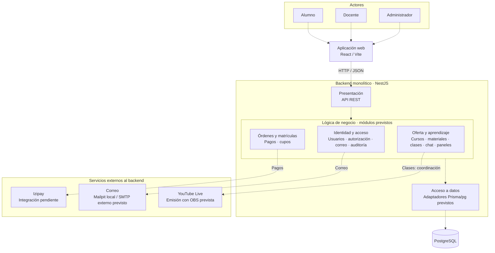

# Estilo arquitectónico

## 1. Estilo seleccionado

Academia Virtual adopta un **monolito por capas, organizado internamente en módulos**, conforme a R01 de las [decisiones arquitectónicas](../analisis-de-sistema/07-decisiones-arquitectonicas.md). El backend NestJS constituye una sola aplicación: sus módulos se componen y ejecutan dentro del mismo proceso, con colaboración interna mediante interfaces públicas. Los módulos no son servicios desplegados de forma independiente.

La vista general separa tres capas lógicas: presentación, lógica de negocio y datos. Esta separación expresa responsabilidades; no exige tres servidores ni tres carpetas globales. Dentro de cada módulo se organizan las responsabilidades que necesite, según el [plan de identidad](../specs/001-identidad-acceso-roles/plan.md).

React/Vite proporciona la aplicación web; NestJS recibe solicitudes mediante la API REST; PostgreSQL proporciona persistencia. **Clean Architecture** es el enfoque interno relacionado que orienta las dependencias hacia los casos de uso y el dominio. Su desarrollo detallado corresponde a una vista distinta del estilo.

Docker Compose organiza el entorno local de ejecución de PostgreSQL, Mailpit, API y web. Tener varios contenedores no convierte el backend en microservicios: cada contenedor cumple una función operativa y los módulos de negocio permanecen dentro de una única aplicación NestJS.

## 2. Justificación y trazabilidad

La elección responde a los [drivers vigentes](../analisis-de-sistema/06-driver-arquitectonicos.md) y conserva los identificadores del registro de decisiones.

| Drivers | Decisiones relacionadas | Justificación del estilo |
| --- | --- | --- |
| DA04, DA07 | R01 | Una persona, cuatro meses y S/300 totales favorecen una aplicación comprensible y una operación sencilla. Las capas y los contratos entre módulos permiten modificar funcionalidades sin afectar innecesariamente otras. |
| DA01, DA09 | R02, R03, R05 | Las entradas REST adaptan el transporte; los casos de uso aplican autorización y consistencia. La separación evita que la interfaz web sea responsable de los permisos definitivos. |
| DA02 | D02 | Un backend y PostgreSQL permiten coordinar transacciones e idempotencia para pagos y matrículas. Las reglas comerciales pendientes deben resolverse antes de implementar estas operaciones. |
| DA03, DA06 | DEC01, R07, R08 | Los módulos consumidores acceden a video, pagos y correo mediante límites de integración. Los detalles de proveedores no deben introducirse en las reglas del dominio. |
| DA05 | R10 | La capacidad debe demostrarse mediante carga y mediciones. El estilo no garantiza por sí mismo 1000 usuarios concurrentes. |
| DA08, DA10 | D13, R11, R12 | Persistencia, recuperación y operación reproducible necesitan procedimientos propios. Docker Compose facilita el entorno local, pero no acredita respaldo ni disponibilidad de producción. |

## 3. Componentes principales y estado

La [arquitectura inicial](arquitectura-inicial.md) aporta la vista general del alcance. Para video se conserva la elección vigente de YouTube Live con OBS, definida en DA03 y DEC01; su compatibilidad con los requisitos de acceso sigue pendiente.

| Componente | Ubicación o referencia | Estado |
| --- | --- | --- |
| Aplicación web React/Vite | [apps/web/src/app/App.tsx](../apps/web/src/app/App.tsx) y [entrada web](../apps/web/src/main.tsx) | Base implementada; muestra «En preparación». Pantallas y flujos por rol pendientes. |
| Aplicación NestJS | [AppModule](../apps/api/src/app.module.ts), [ProbeModule](../apps/api/src/probe.module.ts) y [arranque](../apps/api/src/main.ts) | Composición implementada con Probe y `GET /health/live`. API REST funcional de negocio pendiente. |
| Identidad, usuarios, autorización, correo y auditoría | [Plan de identidad](../specs/001-identidad-acceso-roles/plan.md) | Módulos diseñados; no implementados como funcionalidades. |
| Oferta académica, órdenes, pagos, matrículas, materiales, clases, chat y paneles | [Alcance vigente](../docs/alcance-mvp.md) | Módulos previstos para el conjunto del sistema; requieren especificación e implementación. |
| Persistencia PostgreSQL y adaptadores Prisma/pg | [Modelo previsto](../specs/001-identidad-acceso-roles/data-model.md) y [ensayo de compatibilidad](../ops/local/compatibility/prisma/schema.prisma) | PostgreSQL y ensayo técnico comprobados; el ensayo contiene CompatibilityProbe, no las entidades funcionales de identidad o académicas. |
| Izipay, correo externo y YouTube Live con OBS | D02, R07 y DEC01 del registro de decisiones | Integraciones funcionales pendientes. Mailpit funciona como servicio de captura local; no demuestra entrega externa. |
| Entorno Docker Compose | [Verificación local](../ops/docker/verification.md) | PostgreSQL, Mailpit, API y web validados en el commit `47c8338`. |

Los paquetes instalados y las pruebas de compatibilidad no equivalen a funcionalidades implementadas. Identidad, pagos, video, recuperación y la prueba de 1000 concurrentes permanecen pendientes de aceptación funcional.

## 4. Responsabilidades de las capas

| Capa | Responsabilidad | Componentes del proyecto |
| --- | --- | --- |
| Presentación | Ofrecer la interfaz web y adaptar solicitudes y respuestas REST: rutas, DTO, cookies y errores públicos. Invocar casos de uso sin decidir las reglas definitivas ni consultar directamente la base de datos desde la web. | React/Vite en `apps/web/`; entradas HTTP NestJS en `apps/api/`. Actualmente existen la pantalla de preparación y la entrada de salud; las entradas funcionales están previstas. |
| Lógica de negocio | Coordinar casos de uso y aplicar reglas de cuentas, autorización, oferta, precios, cupos, matrícula y acceso académico. Colaborar mediante capacidades públicas de los módulos y contratos de persistencia e integración. | Aplicación y dominio dentro de los módulos previstos de NestJS: identidad, usuarios, autorización, oferta, órdenes, pagos, matrículas, materiales, clases, chat, paneles, correo y auditoría. |
| Datos | Implementar persistencia, consultas y transacciones; preservar invariantes mediante restricciones e índices. Aplicar migraciones controladas. No orquestar pagos, correo ni video desde la base de datos. | Adaptadores Prisma/pg de cada módulo y PostgreSQL. La persistencia funcional está prevista; el ensayo técnico actual verifica compatibilidad. El almacenamiento de materiales aún debe definirse. |

Los adaptadores de servicios externos pertenecen a la infraestructura del módulo que los utiliza. No convierten los proveedores en una capa de datos ni obligan a añadir una cuarta capa de negocio. En la vista de tres capas, aplicación y dominio forman la lógica de negocio; los detalles de dependencia interna se rigen por R01 y el plan.

## 5. Comunicación entre componentes

La aplicación web enviará solicitudes a la API REST mediante HTTP/JSON y rutas relativas bajo el mismo origen, según R03 y el [contrato de identidad](../specs/001-identidad-acceso-roles/contracts/api.md). HTTPS corresponde al despliegue público previsto; la validación local de Docker no acredita ese despliegue.

Las entradas NestJS invocarán casos de uso. Los módulos colaborarán dentro del mismo proceso mediante interfaces públicas, sin llamadas HTTP entre módulos ni acceso a sus archivos internos. Los casos de uso utilizarán adaptadores inyectados para acceder a PostgreSQL y servicios externos; el dominio no dependerá de Prisma, SMTP ni DTO de transporte.

Pagos utilizará el adaptador Izipay; correo utilizará un adaptador SMTP, con Mailpit como destino local y un proveedor externo todavía por definir. Clases coordinará las necesidades de acceso al video de YouTube Live. El docente emitirá con OBS hacia YouTube Live y la web utilizará su reproducción; el tráfico de medios no se almacenará ni circulará por PostgreSQL. Esta colaboración de video es prevista y su control de acceso aún debe validarse.

El chat previsto requiere su propio contrato de comunicación y autorización por clase. El diagrama resume componentes y no representa todos los protocolos ni cada llamada interna. PostgreSQL no llama a proveedores externos.

## 6. Diagrama del estilo

La vista representa el diseño previsto sobre la base técnica existente. Las líneas discontinuas indican colaboración funcional pendiente. Los tres grupos de módulos dentro del negocio resumen responsabilidades; no son nuevas unidades de despliegue ni sustituyen los nombres de los módulos del plan.

Las flechas representan colaboración en ejecución, no dirección de importaciones. Los proveedores se conectan a los módulos consumidores. La base web/API y PostgreSQL existen; el recorrido por módulos y adaptadores de negocio está previsto. Mailpit está validado como servicio local, mientras que SMTP externo, Izipay y video no cuentan con integración funcional comprobada. El flujo de emisión y reproducción se explica en la sección de comunicación para mantener compacta esta vista.

## 7. Beneficios y limitaciones

La aplicación única reduce la complejidad de despliegue y coordinación para el equipo disponible. Las capas y los módulos delimitan responsabilidades y permiten probar reglas sin acoplarlas al transporte o a proveedores. PostgreSQL permite aplicar mecanismos de consistencia a operaciones relacionadas, y los adaptadores facilitan sustituir integraciones sin alterar innecesariamente el dominio.

El backend comparte proceso y recursos: un fallo o saturación puede afectar a varios módulos, y su despliegue se realiza como unidad. La modularidad requiere disciplina en los contratos y las dependencias; no surge únicamente de separar carpetas. Las reglas comerciales, las integraciones y las políticas de recuperación pendientes limitan lo que puede demostrarse actualmente.

El rendimiento y la escalabilidad deben evaluarse con pruebas reproducibles. Los **1000 usuarios concurrentes siguen siendo un objetivo por demostrar**. Caché o escalamiento horizontal solo pueden considerarse posibilidades por validar a partir de mediciones, no capacidades implementadas. Docker Compose tiene validación local registrada y no demuestra disponibilidad, recuperación ni capacidad de producción.
