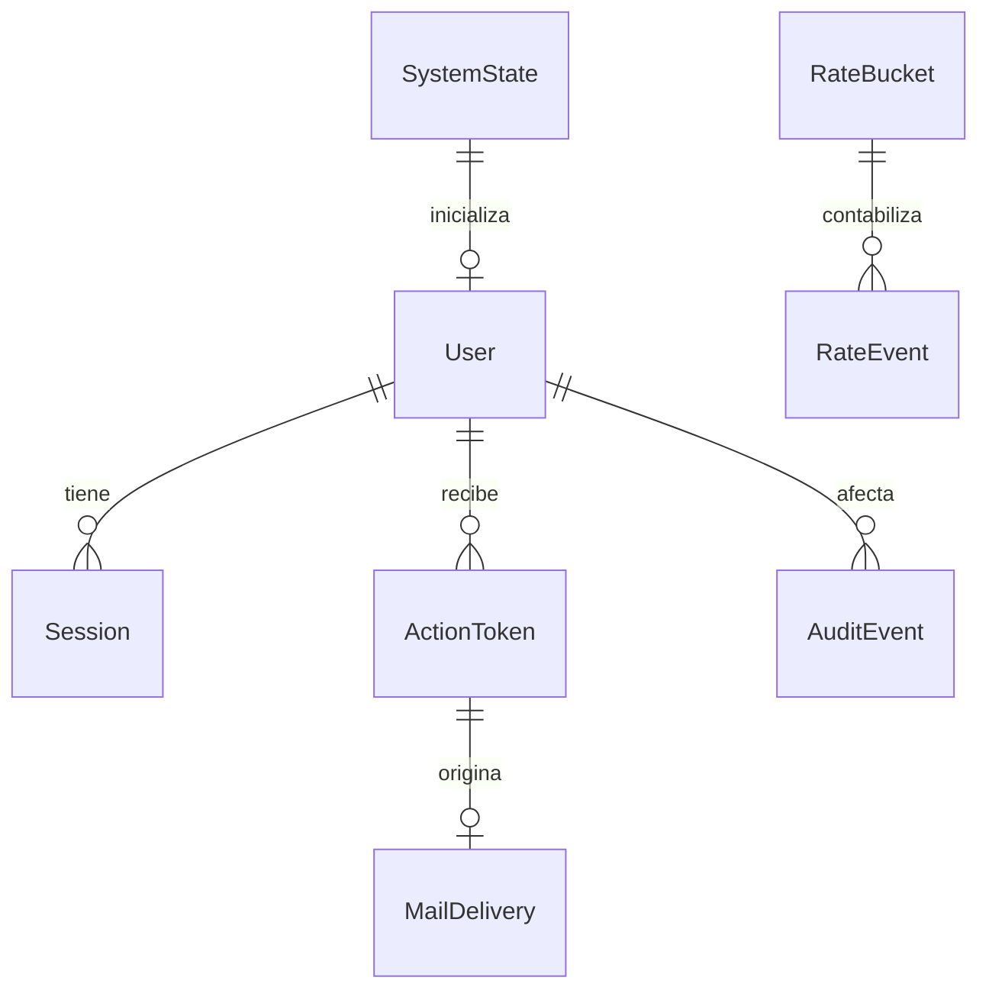

# Modelo de datos de identidad

Fecha: 2026-09-23. Diseño para PostgreSQL 16 (R12: local 16.14) y Prisma 7; no hay esquema ni migraciones
implementados. Requisitos: [spec.md](spec.md); decisiones: [research.md](research.md).
Revisión: 2026-09-24. Ambas versiones son candidatas hasta la comprobación práctica inicial.
Todas las fechas son `timestamptz` en UTC; los límites temporales usan el reloj de la BD.
Los identificadores de entidades son UUID aleatorios; no sustituyen comprobaciones de permisos.

## Entidades y relaciones

### User

| Campo | Tipo y regla |
| --- | --- |
| id | UUID, PK |
| name | Texto 1–100 caracteres Unicode tras trim exterior |
| email | Correo validado, máximo 254 caracteres, sin espacios exteriores |
| emailCanonical | `lower(trim(email))`, obligatorio, UNIQUE; sin transformar alias |
| role | Enum único `STUDENT`, `TEACHER`, `ADMIN`; nunca lista ni tabla muchos-a-muchos |
| status | Enum `ACTIVE`, `DISABLED`; independiente de verificación |
| emailVerifiedAt | Nullable; ausencia impide sesión de aplicación |
| passwordHash | Argon2id codificado; nullable solo mientras `mustSetPassword=true` |
| mustSetPassword | Boolean; true para altas administrativas y bootstrap |
| provisionalPasswordHash | Argon2id nullable, nunca texto claro |
| provisionalExpiresAt | Nullable; creación +24 h si existe credencial provisional |
| authVersion | Bigint >=0, inicia en 0; incrementa en establecimiento inicial, reset, cambio efectivo de rol o desactivación |
| createdAt, updatedAt, disabledAt | Fechas; `disabledAt` solo para estado desactivado |

Restricciones: longitud en BD para nombre/correo, enum no nulo y único índice sobre correo
canónico; comprobar coherencia entre correo y canónico con CHECK en migración. Desactivación
no libera el correo. Si `mustSetPassword=false`, `passwordHash` no puede ser null y los campos
provisionales son null. Con credencial provisional debe existir caducidad. No se guardan
DNI, dirección, teléfono ni datos académicos en esta funcionalidad.

Consulta/autenticación normaliza correo de la misma forma que el índice. Las contraseñas
se validan por 12–128 caracteres Unicode sin normalizar, trim ni truncar; no se persiste su
longitud ni contenido. `User` no se serializa directamente: proyección pública limitada.

### Session

| Campo | Tipo y regla |
| --- | --- |
| id | UUID interno, PK; no es el secreto enviado al navegador |
| tokenHash | SHA-256 de 32 bytes aleatorios, UNIQUE, longitud fija |
| userId | FK User, ON DELETE RESTRICT |
| authVersion | Versión del usuario al iniciar sesión |
| createdAt | Instante de creación |
| lastAcceptedAt | Última operación protegida aceptada; inicia al login |
| absoluteExpiresAt | `createdAt + 8 horas` |
| revokedAt | Nullable; revocación irreversible |

Índices: tokenHash único; `(userId, revokedAt)` para revocación; absoluteExpiresAt para limpieza.
Es válida solo si no revocada, `now < absoluteExpiresAt`, `now < lastAcceptedAt +30 min`,
versión coincide y cuenta activa/verificada/sin cambio de contraseña pendiente. Igualdad
con cualquiera de los límites ya significa expiración. Actualizar actividad con `GREATEST`
para que solicitudes concurrentes no la retrocedan; solo después de autorizar una operación
que termine con éxito. Un 4xx/5xx, polling de salud o un intento público no la renueva.
No se toca la expiración absoluta ni se reactiva una sesión expirada.

### ActionToken

| Campo | Tipo y regla |
| --- | --- |
| id | UUID, PK |
| userId | FK User |
| purpose | Enum `VERIFY_EMAIL`, `RESET_PASSWORD` |
| tokenHash | SHA-256 del secreto aleatorio de 32 bytes, UNIQUE |
| emailCanonicalSnapshot | Destinatario vinculado a emisión; debe coincidir al consumir |
| createdAt, expiresAt | Verificación: +24 h; recuperación: +30 min |
| consumedAt, revokedAt | Nullable; no pueden coexistir ambos valores |

Índice único parcial `(userId, purpose)` donde consumedAt y revokedAt sean null. Una emisión
nueva revoca también tokens vencidos aún no marcados antes de insertar el nuevo; no usar
`now()` en un predicado de índice. Índices por expiresAt y userId/purpose.
Consumo exige propósito exacto, cuenta activa y `now < expiresAt`; reset exige además correo
verificado. Caducidad no se extiende con reintentos de correo. Rol cambiado no convierte un
token de un propósito en otro; los tokens nunca contienen ni asignan rol.

### MailDelivery

| Campo | Tipo y regla |
| --- | --- |
| id | UUID, PK |
| tokenId | FK ActionToken nullable, UNIQUE, ON DELETE SET NULL; obligatorio para PENDING/SENDING: una entrega lógica por token |
| status | `PENDING`, `SENDING`, `SENT`, `FAILED`, `CANCELLED` |
| recipientKey, originKey | HMAC de las claves de límite, sin IP/correo en logs |
| encryptedPayload, nonce, authTag, keyId | Payload cifrado AES-256-GCM con correo, enlace y plantilla; nullable al finalizar |
| attempts | 0–3; incrementa al reclamar un intento que contactará SMTP |
| nextAttemptAt, leaseUntil, claimId | Agenda y propiedad temporal persistente del intento |
| createdAt, sentAt, finishedAt | Fechas operativas; sentAt significa aceptación SMTP, no lectura ni entrega final |
| lastErrorClass | Categoría controlada: TIMEOUT, TEMPORARY, PERMANENT, EXPIRED; sin cuerpo remoto |

Índices: `(status, nextAttemptAt)` y leaseUntil. Clave de cifrado fuera de BD y repositorio.
Reintentos usan el mismo payload y token. Limpiar payload/nonce/tag al estado terminal;
una limpieza periódica cancela vencidos aunque SMTP esté caído. Antes de enviar se revalida
token/cuenta y se reserva cuota. Si falta cuota, reprogramar sin gastar intento; si no cabe
antes de expiresAt, cancelar. Un estado terminal permite tokenId null tras purgar el token,
para conservar metadatos sin conservar el secreto. CHECK exige tokenId y payload para estados
PENDING/SENDING. Un lease perdido puede producir correo duplicado con el mismo
enlace: `claimId` evita que un ejecutor viejo confirme el estado de uno nuevo, y consumo
atómico evita doble modificación de cuenta. No hay garantía SMTP de exactamente una entrega.

### RateBucket y RateEvent

`RateBucket`: clave PK HMAC con ámbito (`LOGIN_PAIR`, `MAIL_RECIPIENT_PURPOSE`, `MAIL_ORIGIN`),
fase `ADMISSION` o `SMTP` para correo, `blockedUntil` nullable y `updatedAt`.
`RateEvent`: UUID, FK bucket, instante, identificador de intento/entrega nullable,
estado `RESERVED`/`FAILED`/`ACCEPTED` y `reservationExpiresAt` nullable.
Crear bucket con upsert y bloquear los buckets aplicables en
orden lexicográfico antes de contar/admitir un evento. Usar rangos móviles exactos, no
ventanas de reloj que permitan duplicar cuota al cambiar de minuto u hora.

Login: fallos de los últimos 15 min; quinto fallo fija blockedUntil por 15 min. Durante el
bloqueo devolver 429 sin prolongarlo por cada intento. Éxito limpia los fallos de esa pareja.
Reservar intentos en vuelo para que el paralelismo no eluda el límite; no sostener el lock
durante Argon2. El resultado transforma/libera la reserva bajo lock; reservas vencen tras
30 s y cuentan conservadoramente como fallo si el proceso cae. Mismas reglas para cuenta
inexistente. No hay bloqueo administrativo del usuario por este mecanismo.

Correo: una admisión por minuto y cinco por hora/destinatario/propósito; veinte por hora/origen
en conjunto. Registro y reenvío comparten el ámbito VERIFY_EMAIL. Las admisiones a correos
inexistentes consumen la misma cuota; no emiten MailDelivery. La admisión pública y el envío
SMTP usan buckets distintos con los mismos límites: el primer envío no se cuenta dos veces
en un bucket. El worker reserva cuota SMTP al contactar transporte, para cada intento,
incluidos reintentos; así los envíos reales también respetan intervalos y máximos. No se
consulta cuota SMTP para decidir el mensaje HTTP público. No reiniciar ventanas al arrancar.
Conservar eventos máximo 24 h; índice `(bucketKey, occurredAt)`; limpiar buckets inactivos
tras 24 h sin eventos, reservas ni bloqueos vigentes. HMAC key independiente del cifrado de mail.

### AuditEvent

UUID, `actorUserId` nullable solo para actor de bootstrap identificado como `SYSTEM_BOOTSTRAP`,
`targetUserId`, acción permitida, resultado, instante, `requestId` aleatorio y cambios
permitidos de rol/estado. FK sin eliminación en cascada. Nombre/correo no se duplican en
auditoría. Esta tabla registra operaciones administrativas aceptadas sobre cuentas existentes,
incluida la cuenta creada en esa misma transacción; no es el registro de todo intento HTTP.

Precisiones de U1 (2026-09-25):

- `actorKind`: enum `ACCOUNT` o `SYSTEM_BOOTSTRAP`. ACCOUNT exige `actorUserId` no nulo,
  FK a un usuario revalidado; SYSTEM_BOOTSTRAP exige actorUserId null y solo permite la
  acción `BOOTSTRAP_ADMIN_CREATED`. No crear un usuario ficticio para representar al sistema.
- `targetUserId`: obligatorio, FK al usuario afectado existente. Acciones permitidas:
  `ACCOUNT_CREATED`, `BOOTSTRAP_ADMIN_CREATED`, `NAME_CHANGED`, `ROLE_CHANGED`, `STATUS_CHANGED`.
  `result`: `APPLIED` o `NO_CHANGE`; este último describe una petición idempotente aceptada,
  nunca una denegación. Se permite registrar que cambió el nombre, no sus valores.
- Instante UTC, IDs UUID, `requestId` de correlación generado internamente y, solo si cambian,
  valores anterior/nuevo de los enums de rol/estado. No se admiten campos arbitrarios.
- El evento y el cambio aceptado comparten commit; si falla su persistencia, se revierte
  la operación. Una denegación/fallo no inserta un AuditEvent con destino inexistente ni
  pierde una auditoría ya confirmada: se registra por el canal siguiente después del rollback.

### Registros operativos y de seguridad (sin tabla de cuentas ni FK)

Eventos estructurados en el registro privado de aplicación, no nuevas entidades Prisma ni
un servicio de logging externo. Se conservan como máximo 30 días mediante rotación local;
no se versionan ni exponen a la API. No consultar User para enriquecer una denegación.

Lista de campos permitidos: `eventId` y `correlationId` UUID internos, `occurredAt` UTC,
`category` (`SECURITY`/`OPERATION`), `action` de la lista de abajo, `result`
(`STARTED`/`SUCCEEDED`/`DENIED`/`FAILED`), `reasonCode` controlado, `actorKind` y los
identificadores opcionales descritos aquí. La referencia de ruta, si se incluye, es una
plantilla fija como `/admin/users/:id`, no la URL recibida. No hay mensaje libre del cliente.

- Actor `ACCOUNT`: `actorUserId` solo si la identidad fue comprobada; es referencia de log,
  no FK ni afirmación de autorización actual. Actor `ANONYMOUS`: sin actorUserId ni correo;
  incluye autenticación fallida. Actor `SYSTEM`: trabajos internos, sin usuario.
- Actor `LOCAL_OPERATOR`: `operatorRef` obligatorio, alias operativo no secreto de 1–64
  caracteres ASCII `[A-Za-z0-9_-]`, aportado por el responsable a la entrada CLI. No tiene
  valor predeterminado ni se obtiene del correo, nombre de Windows o hostname. Identifica
  al responsable declarado, no autentica: la restricción sigue siendo acceso local a
  configuración/BD. La CLI valida el alias, genera correlación y nunca crea un User por él.
- Destino `USER_REFERENCE`: `requestedTargetId` opcional, solo UUID bien formado recibido;
  no se resuelve, no tiene FK y no lleva indicador de existencia. Un ID mal formado se omite.
  Destino `IDENTITY_SCOPE`: operación global, sin usuario destino. Destino `NONE`: rutas
  públicas sin ID. No registrar correos/IP o cuerpos para inventar un destino.
- Acciones permitidas: `ACCESS_DENIED`, `AUTHENTICATION_FAILED`, `ADMIN_COMMAND_REJECTED`,
  `BOOTSTRAP_ATTEMPT`, `RESTORED_STATE_INVALIDATION`, `MAIL_DELIVERY_FAILED`, `RUNTIME_FAILURE`.
  Motivos permitidos: `AUTH_REQUIRED`, `INVALID_CREDENTIALS`, `FORBIDDEN`, `REQUEST_NOT_ALLOWED`,
  `VALIDATION_ERROR`, `NOT_FOUND`, `ACCOUNT_CONFLICT`, `ADMIN_INVARIANT`, `RATE_LIMITED`,
  `ALREADY_INITIALIZED`, `TEMPORARILY_UNAVAILABLE`, `SMTP_FAILURE`, `NONE`.
  Usar únicamente el motivo seguro ya autorizado para esa operación; NOT_FOUND solo después
  de autorizar ADMIN. En login fallido, INVALID_CREDENTIALS no detalla estado/existencia.
- Bootstrap registra intento/resultado LOCAL_OPERATOR con destino IDENTITY_SCOPE, correlacionado
  con el AuditEvent SYSTEM_BOOTSTRAP solo si se creó la cuenta. Restauración/invalidez global
  usa LOCAL_OPERATOR + IDENTITY_SCOPE; puede añadir conteos agregados de sesiones/tokens/mail
  afectados al resultado exitoso, nunca IDs de secretos ni una fila de cuenta ficticia.
- Rechazar un ID conocido o desconocido por falta de permisos produce la misma respuesta y
  el mismo esquema/motivo de log, sin lookup adicional. Si falla este canal, emitir solo un
  aviso local saneado; no convertir el 403/401 en otro status, efectuar la operación ni
  revelar el fallo al solicitante. Esto no relaja el commit obligatorio de AuditEvent.

Ambos canales excluyen contraseñas propias/provisionales y sus hashes, cookies, cabeceras de
autenticación, tokens o sus hashes, enlaces completos, payloads de correo, nombres/correos/IP,
cuerpos HTTP, SQL/errores SMTP remotos, variables de entorno y claves. El campo UserView del
contrato no se copia completo al log. La capa de aplicación produce hechos/resultados tipados;
infraestructura persiste/emite y las entradas HTTP/CLI adaptan contexto, sin trasladar reglas
de negocio al logger. V12 prueba listas permitidas y también denegaciones con destinos
inexistentes y operadores locales; V16 prueba el evento operativo de restauración.

### SystemState

Fila singleton con PK constante, `bootstrapCompletedAt` nullable y `firstAdminUserId` nullable.
La migración crea la fila; bootstrap la bloquea, exige que no se haya completado y que no
exista ningún administrador, crea usuario y marca el estado en la misma transacción.
Todos los caminos de alta ADMIN y cambios de rol/estado usan ese mismo lock y marcan
bootstrap completado si fuese necesario; nunca se vuelve a null. Desactivar cuentas o
restaurar una sesión no permite repetir bootstrap. No existe endpoint público de bootstrap.

## Estados y transiciones

| Acción | Precondiciones | Cambios atómicos |
| --- | --- | --- |
| Registro | Datos válidos; correo único | ACTIVE, STUDENT, correo pendiente, hash propio; token/mail si cuota permite |
| Alta administrativa/bootstrap | Actor autorizado o inicialización única | ACTIVE, rol único, correo pendiente, credencial provisional; auditoría y token/mail |
| Verificación | Token VERIFY_EMAIL válido; cuenta activa | consumedAt y emailVerifiedAt; nunca crea sesión |
| Establecer contraseña inicial | Credencial provisional vigente, cuenta activa | Hash propio, limpiar provisional, mustSetPassword=false, authVersion++, sin sesión; no marca correo verificado |
| Login | ACTIVE, correo verificado, contraseña propia, versión revalidada | Nueva sesión y nuevo secreto; no reutiliza cookie anterior |
| Logout | Sesión presente o ausente | Revocar solo esa sesión si existe; expirar cookie; respuesta idempotente |
| Desactivar | Administrador habilitado; no propia; no último ADMIN activo | DISABLED, authVersion++, revocar sesiones y ambos propósitos de token, cancelar mail pendiente, auditoría |
| Reactivar | Administrador habilitado | ACTIVE, sin restaurar sesiones/tokens; no verifica correo ni restablece contraseña |
| Cambiar rol | Administrador habilitado; no propio; no último ADMIN activo | Reemplazar rol, authVersion++, revocar sesiones, auditoría |
| Recuperar contraseña | Token RESET_PASSWORD válido; ACTIVE y verificado | Hash nuevo, mustSetPassword=false, consumir token usado y revocar otros reset pendientes, authVersion++, revocar sesiones, limpiar provisional, sin login |

Un cambio idempotente al mismo estado/rol no vuelve a emitir credenciales ni cambia versiones.
Las verificaciones de último administrador cuentan `role=ADMIN AND status=ACTIVE` de acuerdo
con la especificación; probar además que la segunda cuenta administrativa pueda completar
verificación y acceso antes de retirar acceso a la primera en procedimientos operativos.

## Invariantes transaccionales

1. Unicidad canónica en BD, no solo comprobación previa del formulario; conflicto de registro
   público se convierte a 202 genérico sin sobrescribir nada, o al mismo 429 que un correo
   nuevo si falta cuota de envío. Alta administrativa puede dar 409.
2. Orden de bloqueos: gobierno si corresponde → usuarios por UUID → sesión/token → correo.
   Los límites se reservan en transacciones cortas separadas antes de la operación; no
   adquirir locks de cuotas mientras se mantienen locks de cuentas ni durante SMTP.
3. Hash de contraseña fuera del lock; comprobar hash y authVersion otra vez bajo lock antes
   de login o sustitución de credencial inicial. Rechazar credenciales que cambiaron mientras
   se calculaba Argon2, aunque el cálculo anterior fuese correcto.
4. Token válido se consume con modificación de cuenta en el mismo commit. Doble consumo,
   reenvío simultáneo y reset/desactivación simultáneos se serializan sobre el usuario.
   Marcar consumedAt únicamente en el token usado; revocar solo otros tokens no consumidos.
   Desactivar/reemitir no añade revokedAt a tokens ya consumidos, conservando el CHECK.
5. Cambios administrativos bloquean/revalidan actor y destino: un administrador cuyo rol
   fue retirado no puede confirmar una escritura basada en un guard antiguo.
6. Responder éxito después de commit; las solicitudes recibidas después de una revocación
   confirmada consultan la base primaria y se rechazan. No hay réplica de lectura ni cache
   de autorización que pueda prolongar acceso. No se revierten efectos previos confirmados.
7. Transacciones cortas con dos reintentos por conflicto transitorio. Error persistente:
   rollback y respuesta 503 genérica; no afirmar éxito ni consumir token parcialmente.

## Migraciones previstas

1. Crear enums, User, índices de correo y CHECKs de coherencia.
2. Crear Session, ActionToken, índices parciales, AuditEvent y singleton SystemState.
3. Crear MailDelivery, RateBucket, RateEvent e índices de agenda/ventanas; restricciones
   de intentos y estados. Registrar claves de cifrado solo en configuración, nunca en SQL.

Son agrupaciones de diseño para futuras migraciones revisables, no archivos creados. Prisma
gestionará el esquema; CHECKs e índices/bloqueos no expresables en el esquema se incorporarán
mediante SQL parametrizado o migración SQL revisada. No usar `db push` para demo/producción.
Ejecutar generación del cliente explícitamente y validar migraciones contra una BD vacía y
una copia de prueba; no incluir usuarios, contraseñas ni correos reales como seed.

## Retención operativa inicial

Limpieza interna por lotes, reanudable: sesiones expiradas/revocadas después de 24 h; tokens
terminales tras 24 h; metadatos de entregas durante 7 días; auditoría durante 30 días.
Al purgar tokens terminales tras 24 h, ON DELETE SET NULL elimina su vínculo en MailDelivery,
conservando sus metadatos durante los 7 días previstos. No purgar tokens con entregas todavía
activas: antes cancelar/terminar la entrega y limpiar su payload. Nunca borrar User para
purgar sesiones. Payload cifrado se borra inmediatamente
al estado terminal, sin esperar la retención de metadatos. Las cuentas se conservan en esta
funcionalidad y no se implementa borrado definitivo. Backups se cifran y no se versionan.

## Ubicación de reglas y persistencia

Este documento modela almacenamiento, no impone clases de dominio por tabla. Las reglas
de cuenta, rol y elegibilidad son funciones/tipos del dominio; la aplicación coordina los
casos de uso. Los CHECKs, consultas, locks y transacciones son adaptadores de infraestructura
del módulo dueño de la operación, según las capas de [plan.md](plan.md). Prisma y sus tipos
no llegan a controladores, dominio ni frontend; el pool compartido no contiene reglas.
