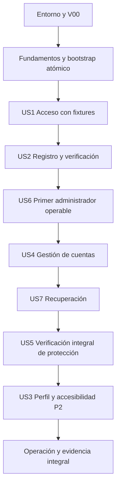

# Tareas: Identidad, autenticación y acceso por roles

**Fecha**: 2026-09-24 · **Rama real**: `feat/001-identidad-acceso-roles`.
**Corrección documental**: 2026-09-25, I1/I2/U1/U2. Adaptación R12: 2026-09-27; se conservan los 108 IDs.

**Entrada**: [spec.md](spec.md), [plan.md](plan.md), [research.md](research.md),
[data-model.md](data-model.md), [API](contracts/api.md), [UI](contracts/ui.md),
[quickstart.md](quickstart.md), [verification.md](verification.md) y
[constitución 1.1.0](../../.specify/memory/constitution.md).

**Estado vigente (2026-10-01)**: V00 nativo aprobado; T003–T010 verificadas según evidencia del 2026-09-29. El responsable confirma Docker operativo en su computadora; la comprobación completa de T001/T002 y V00-L sigue pendiente, sin ejecución de la aplicación con Docker acreditada. Véanse [compatibilidad](../../ops/local/compatibility.md) y [actualización del entorno](../../ops/local/environment.md#actualización-docker--2026-10-01). Historias sin implementar.
**Registro histórico de generación**: no había aplicación, dependencias instaladas ni pruebas superadas. Se conservaron README y los siete documentos de planificación
existentes. No había tasks.md. `setup-tasks.ps1 -Json` resolvió esta carpeta y la plantilla
instalada; no se encontraron AGENTS.md aplicables ni `.specify/extensions.yml` con hooks.
Las referencias a etapas anteriores de spec/checklist/plan son registros históricos.

## Formato y reglas de ejecución

Cada tarea usa `- [ ] Tnnn [P?] [USn?] descripción con rutas`. US corresponde a la historia
del mismo número de spec.md. Las rutas son destinos previstos relativos a la raíz, no archivos
que ya existan. Las migraciones tendrán el prefijo temporal que genere Prisma; se indican
abajo nombres deterministas para identificar su contenido antes de generarlas.

- **Automatizable** es el modo predeterminado: editar, ejecutar y registrar evidencia local
  durante implementación. **MANUAL** exige intervención del responsable; no la realiza
  automáticamente el agente, especialmente si modifica Windows o requiere participantes.
- `Dep.:` enumera requisitos directos. Las dependencias son transitivas. Una tarea sin `[P]`
  se ejecuta de forma serial en el orden recomendado; `[P]` solo habilita el grupo independiente
  indicado al final, después de completar sus dependencias. No autoriza usar la misma BD de
  pruebas simultáneamente: cada suite necesita su BD/fixtures/contextos aislados.
- Las tareas de **escritura de pruebas** se completan cuando la suite/harness es ejecutable
  y se registra el fallo de una aserción debido al comportamiento faltante. No cuentan fallos
  de importación, compilación, conexión, fixtures o configuración; preparar primero el harness
  necesario. Completar esta escritura habilita sus tareas dependientes de implementación:
  no exige que pase una conducta que todavía no existe y no equivale a aprobar la prueba.
  Si una prueba cubre conducta ya implementada, puede pasar desde el inicio; no forzar un
  fallo artificial. Las tareas de **aceptación** y sus checkpoints sí exigen que las pruebas
  aplicables pasen con implementación real, sin omitir casos pendientes. Esta distinción
  se aplica a todos los grupos de la tabla de cierre siguiente. Ninguna tarea se marca aquí.
  No reemplazar PostgreSQL por SQLite/mocks para demostrar transacciones; conservar evidencia.
- Las restricciones citadas bajo T012–T015 forman parte de sus descripciones y se copian
  literalmente del modelo para evitar decisiones implícitas durante implementación.
- Entrada HTTP adapta DTO/cookies/errores; aplicación coordina comandos y actor; dominio
  contiene reglas puras; infraestructura implementa IO y atomicidad. Dependencias:
  entrada → aplicación → dominio; infraestructura → contratos de aplicación/dominio.
  Nest compone adaptadores. No Prisma en controladores/dominio/frontend, Request/Response en
  casos de uso, ciclos entre módulos, repositorios genéricos ni interfaces sin una necesidad real.
- Ninguna entrega parcial omite autorización, validación o protección de secretos. US5
  verifica transversalmente controles ya integrados desde fundamentos y en cada endpoint.
- Este documento no ordena commits, push, merge, contratación ni despliegue. La generación
  actual no ejecuta ninguna tarea. Antes de implementar corresponde `$speckit-analyze`.

| Escritura de pruebas (habilita implementar con fallo esperado documentado) | Implementación / integración que desbloquea | Aceptación con pruebas satisfactorias |
| --- | --- | --- |
| T031–T033 · US1 | T034 | T039, solo alcance disponible; V04-B permanece pendiente |
| T040–T042 · US2 | T043 | T049 |
| T050–T052 · US6 | T053 | T058; recuperación de provisional vencida se completa en T081 |
| T059–T061 · US4 | T062 | T071, incluido V04-B |
| T072–T074 · US7 | T075 | T081 |
| T082–T084 · US5 | T085 | T088 |
| T089–T090 · US3 | T091 | T094 |

En estos grupos, `Dep.:` de la implementación significa **escritura completada**, no aceptación
previa de la funcionalidad. Las demás tareas que implementan y prueban juntas, así como V00,
retención, recuperación y carga, conservan sus propios resultados satisfactorios de cierre.

**Actualización R12 — 2026-09-27:** desarrollo nativo Windows con Node, PostgreSQL 16.14 y Mailpit. Docker/WSL pendientes, fuera de la ruta crítica local; causa del incidente de arranque no determinada. Docker en Linux se conserva para despliegue futuro. V00-L se verifica temprano, tras V00 y antes de US1/T031 (checkpoint T030), sin contratar servicios. Procedimiento vigente: [native.md](../../ops/local/native.md); resultados: [compatibility.md](../../ops/local/compatibility.md). No se modifica el alcance funcional ni se afirma capacidad demostrada.

## Fase 1: Preparación del entorno y V00

**Propósito**: comprobar la combinación real antes de construir identidad. Node/npm observados
y versiones candidatas de R01 no equivalen a compatibilidad probada. Solo se crea un esqueleto
y pruebas de compatibilidad en esta fase; no se añaden reglas de negocio.

- [ ] T001 MANUAL DIFERIDA (no completada, fuera de ruta nativa) — Revisar WSL2, Plataforma de máquina virtual y arranque del hipervisor con el responsable del equipo según `specs/001-identidad-acceso-roles/quickstart.md`; resolver prerrequisitos y reinicio si corresponde, y registrar evidencia sin secretos en `ops/local/environment.md`. Salida: WSL2 puede iniciar; no atribuir el problema solo a BIOS. Dep.: ninguna.
- [ ] T002 MANUAL DIFERIDA (no completada, fuera de ruta nativa) — Instalar/configurar Docker Desktop con backend WSL2 y contenedores Linux tras revisar requisitos/licencia; comprobar Client y Server con docker version, Compose y docker info, puertos 5173/3000/5432/1025/8025 y espacio disponible; documentar en `ops/local/environment.md`. No exigir una distribución WSL de usuario adicional. Dep.: T001.
- [x] T003 Crear el esqueleto npm workspaces en `package.json`, `apps/api/package.json` y `apps/web/package.json`; elegir parches compatibles de los candidatos R01, comprobar engines/peers y dependencias nativas de Windows e instalar para generar `package-lock.json`, sin force/legacy-peer-deps. Registrar cambios justificados de versión en `ops/local/compatibility.md`. Dep.: Node/npm comprobados en environment.md (R12 sustituye la dependencia local de T002).
- [x] T004 Preparar servicios nativos según `ops/local/native.md`: `ops/local/provision.sql` crea exclusivamente bases academia_dev/academia_v00_test y roles propietario/runtime por base, sin superusuario en aplicación; credenciales solo locales. `.env.example`, `.env.test.example` y `.gitignore` protegen secretos. Descargar/verificar SHA256 e iniciar Mailpit mediante `ops/local/start-mailpit.ps1`, solo loopback y sin relay. Comprobar conexión con roles exclusivos, aislamiento y captura. Compose original queda pendiente para V00-L; no se marca realizado. Dep.: T003; credenciales manuales locales para SQL.
- [x] T005 Configurar y compilar los esqueletos ESM/TypeScript estricto en `apps/api/tsconfig.json`, `apps/api/src/main.ts`, `apps/api/vitest.config.ts`, `apps/web/tsconfig.json`, `apps/web/vite.config.ts` y `apps/web/src/main.tsx`; Vite localhost:5173 proxifica /api a 127.0.0.1:3000 conservando Origin. Añadir smoke de provider/controlador con metadatos Nest en `apps/api/tests/compatibility/runtime.spec.ts` y componente React en `apps/web/src/app/runtime.test.tsx`. Dep.: T003; build/smoke no requiere conexión SQL (R12).
- [x] T006 Verificar V00 con `ops/local/compatibility/prisma/schema.prisma`, `ops/local/compatibility/prisma/migrations/0001_probe/migration.sql`, `ops/local/compatibility/prisma.config.ts` y `apps/api/tests/compatibility/postgres.spec.ts`: generar Prisma CLI/client/adapter coherentes, migrar una BD de ensayo aislada y hacer escritura/lectura/rollback desde Nest con cierre de pool. El modelo de ensayo no pasa al esquema de identidad. Dep.: T005 y T004 para roles/base aislada (R12).
- [x] T007 Comprobar hash/verificación Argon2id m=19456 KiB, t=2, p=1 y captura SMTP exclusivamente Mailpit en `apps/api/tests/compatibility/crypto-mail.spec.ts`; registrar cualquier prerrequisito nativo faltante y resultados en `ops/local/compatibility.md`. No usar buzones reales. Dep.: T003 y Mailpit verificado de T004; puede comprobarse sin T006 (R12).
- [x] T008 Cerrar V00 ejecutando instalación reproducible npm ci, builds y pruebas de T005–T007; fijar versiones realmente utilizadas en `package-lock.json` y SHA256 del binario Mailpit en `ops/local/native.md`; digests Linux quedan para V00-L, y guardar versiones/SO/comandos/resultados sin secretos en `ops/local/compatibility.md`. Ante incompatibilidad, ajustar y repetir el bloque afectado antes de avanzar; no marcar V00 aprobado parcialmente. Dep.: T004, T005, T006, T007.
- [x] T009 Configurar composición modular mínima y límites de importación en `apps/api/src/app.module.ts`, `apps/api/eslint.config.js` y `apps/web/eslint.config.js`; registrar decisiones de ensamblaje en `ops/local/architecture.md`. Crear archivos/capas solo al necesitarlos; no scaffolding de cursos/pagos ni paquetes shared genéricos. Dep.: T008.
- [x] T010 Preparar harness de pruebas y scripts obligatorios en `apps/api/tests/support/test-environment.ts`, `apps/api/tests/support/mailpit.ts`, `apps/web/playwright.config.ts`, `apps/api/package.json`, `apps/web/package.json` y `package.json`; instalar/verificar navegador de prueba y runners compatibles, con BD aislada por suite y fallos si faltan scripts, sin if-present. Dep.: T009.

**Checkpoint**: T008 documenta instalación, compilación, PostgreSQL real, Argon2 y SMTP local;
T009–T010 añaden límites comprobados y harness reproducible. Docker/WSL local no bloquea V00 nativo;
T001/T002 permanecen pendientes sin casillas de éxito. V00-L Linux se exige en T030 antes de US1. No iniciar T011 ni ninguna historia sin V00 aprobado.

## Fase 2: Fundamentos compartidos

**Propósito**: piezas usadas por las historias, sin plataforma genérica. Todas las historias
dependen del cierre de esta fase. El fundamento atómico del primer administrador está en
T014/T028; su comando y flujo operable se completan en US6 antes de gestionar cuentas reales.

- [ ] T011 Implementar carga explícita y validación por entorno en `apps/api/src/infrastructure/config/environment.ts` y `apps/api/prisma.config.ts`, completar `.env.example` y `.env.test.example` y probar en `apps/api/tests/integration/environment.spec.ts`: BD/claves distintas, secretos vacíos en ejemplos, test explícito, SMTP local restringido, TLS/HTTPS obligatorios en producción, claves independientes de 32 bytes y proxy conocido. Prisma/CLI/API usan el mismo cargador desde raíz; Vite no recibe secretos. Dep.: T010.
- [ ] T012 Modelar User y sus CHECKs/índices en `apps/api/prisma/schema.prisma` y `apps/api/prisma/migrations/0001_identity_users/migration.sql`; mapear fechas a timestamptz UTC y usar reloj de BD. No borrar cuentas ni liberar correo al desactivar. Dep.: T011. Restricciones literales por campo:

  - id: «UUID, PK»; name: «Texto 1–100 caracteres Unicode tras trim exterior»; email: «Correo validado, máximo 254 caracteres, sin espacios exteriores».
  - emailCanonical: «`lower(trim(email))`, obligatorio, UNIQUE; sin transformar alias»; role: «Enum único `STUDENT`, `TEACHER`, `ADMIN`; nunca lista ni tabla muchos-a-muchos»; status: «Enum `ACTIVE`, `DISABLED`; independiente de verificación».
  - emailVerifiedAt: «Nullable; ausencia impide sesión de aplicación»; passwordHash: «Argon2id codificado; nullable solo mientras `mustSetPassword=true`»; mustSetPassword: «Boolean; true para altas administrativas y bootstrap».
  - provisionalPasswordHash: «Argon2id nullable, nunca texto claro»; provisionalExpiresAt: «Nullable; creación +24 h si existe credencial provisional»; authVersion: «Bigint >=0, inicia en 0; incrementa en establecimiento inicial, reset, cambio efectivo de rol o desactivación»; createdAt, updatedAt, disabledAt: «Fechas; `disabledAt` solo para estado desactivado».
  - Coherencia adicional del modelo: «Si `mustSetPassword=false`, `passwordHash` no puede ser null y los campos provisionales son null.»; «Con credencial provisional debe existir caducidad.» CHECK de correo canónico, longitud y enums no nulos; no DNI, teléfono ni dirección.

- [ ] T013 Añadir Session y ActionToken a `apps/api/prisma/schema.prisma` y `apps/api/prisma/migrations/0002_identity_access/migration.sql`, con índices de revocación/expiración y único parcial usuario/propósito cuando consumedAt/revokedAt sean null, sin now() en predicado. Dep.: T012. Restricciones literales:

  - Session.id: «UUID interno, PK; no es el secreto enviado al navegador»; tokenHash: «SHA-256 de 32 bytes aleatorios, UNIQUE, longitud fija»; userId: «FK User, ON DELETE RESTRICT»; authVersion: «Versión del usuario al iniciar sesión».
  - Session.createdAt: «Instante de creación»; lastAcceptedAt: «Última operación protegida aceptada; inicia al login»; absoluteExpiresAt: «`createdAt + 8 horas`»; revokedAt: «Nullable; revocación irreversible».
  - ActionToken.id: «UUID, PK»; userId: «FK User»; purpose: «Enum `VERIFY_EMAIL`, `RESET_PASSWORD`»; tokenHash: «SHA-256 del secreto aleatorio de 32 bytes, UNIQUE»; emailCanonicalSnapshot: «Destinatario vinculado a emisión; debe coincidir al consumir»; createdAt, expiresAt: «Verificación: +24 h; recuperación: +30 min»; consumedAt, revokedAt: «Nullable; no pueden coexistir ambos valores».

- [ ] T014 Añadir AuditEvent y SystemState en `apps/api/prisma/schema.prisma` y completar `apps/api/prisma/migrations/0002_identity_access/migration.sql` con la fila singleton y FKs sin cascada; incluir actorKind ACCOUNT/SYSTEM_BOOTSTRAP y constraints de actor/destino/acciones/resultados de U1 en data-model.md. Solo operaciones aceptadas con destino existente; denegaciones/operación global no crean esta fila ni tablas adicionales de cuentas. Dep.: T013. Restricciones literales:

  - AuditEvent: «UUID, `actorUserId` nullable solo para actor de bootstrap identificado como `SYSTEM_BOOTSTRAP`, `targetUserId`, acción permitida, resultado, instante, `requestId` aleatorio y cambios permitidos de rol/estado.»; «FK sin eliminación en cascada.»; «Nombre/correo no se duplican en auditoría.»
  - SystemState: «Fila singleton con PK constante, `bootstrapCompletedAt` nullable y `firstAdminUserId` nullable.»; «Todos los caminos de alta ADMIN y cambios de rol/estado usan ese mismo lock y marcan bootstrap completado si fuese necesario; nunca se vuelve a null.»

- [ ] T015 Añadir MailDelivery, RateBucket y RateEvent en `apps/api/prisma/schema.prisma` y `apps/api/prisma/migrations/0003_identity_mail_limits/migration.sql`, con índices de agenda/lease/ventanas y CHECK de tokenId/payload obligatorio en PENDING/SENDING. Dep.: T014. Restricciones literales:

  - MailDelivery.id: «UUID, PK»; tokenId: «FK ActionToken nullable, UNIQUE, ON DELETE SET NULL; obligatorio para PENDING/SENDING: una entrega lógica por token»; status: «`PENDING`, `SENDING`, `SENT`, `FAILED`, `CANCELLED`».
  - recipientKey, originKey: «HMAC de las claves de límite, sin IP/correo en logs»; encryptedPayload, nonce, authTag, keyId: «Payload cifrado AES-256-GCM con correo, enlace y plantilla; nullable al finalizar»; attempts: «0–3; incrementa al reclamar un intento que contactará SMTP».
  - nextAttemptAt, leaseUntil, claimId: «Agenda y propiedad temporal persistente del intento»; createdAt, sentAt, finishedAt: «Fechas operativas; sentAt significa aceptación SMTP, no lectura ni entrega final»; lastErrorClass: «Categoría controlada: TIMEOUT, TEMPORARY, PERMANENT, EXPIRED; sin cuerpo remoto».
  - RateBucket: «clave PK HMAC con ámbito (`LOGIN_PAIR`, `MAIL_RECIPIENT_PURPOSE`, `MAIL_ORIGIN`), fase `ADMISSION` o `SMTP` para correo, `blockedUntil` nullable y `updatedAt`.»
  - RateEvent: «UUID, FK bucket, instante, identificador de intento/entrega nullable, estado `RESERVED`/`FAILED`/`ACCEPTED` y `reservationExpiresAt` nullable.»

- [ ] T016 Implementar cliente/pool compartido sin reglas de negocio en `apps/api/src/infrastructure/database/database.ts` y scripts db:generate/db:migrate:dev/db:migrate:deploy en `apps/api/package.json`; aplicar las tres migraciones a BD vacía y copia ficticia, probar constraints/índices/FKs y rollback en `apps/api/tests/integration/migrations.spec.ts`. Revisar SQL no representable en Prisma; no db push ni seed implícito. Dep.: T015.
- [ ] T017 Implementar y probar reglas puras de cuenta/normalización, rol único, estado y expiración en `apps/api/src/modules/users/domain/account.ts`, `apps/api/src/modules/identity/domain/access.ts` y sus archivos `.test.ts`; respetar «12–128 caracteres Unicode sin normalizar, trim ni truncar», fronteras exactas 30 min/8 h/24 h/30 min y elegibilidad sin HTTP/BD. Reutilizar estas funciones en casos de uso, no solo DTOs. Dep.: T016.
- [ ] T018 Implementar los contratos necesarios de hashing/secretos y sus adaptadores en `apps/api/src/modules/identity/application/credentials.ts`, `apps/api/src/modules/identity/infrastructure/credentials.ts` y `apps/api/tests/integration/credentials.spec.ts`: Argon2id con salt, hash ficticio/trabajo equivalente, 2 hashes simultáneos, cola máxima 50/espera 5 s, sobrecarga tipada; secretos aleatorios de 32 bytes/base64url 43 y solo SHA-256 persistido. Dep.: T017.
- [ ] T019 Implementar políticas de ventanas móviles en `apps/api/src/modules/identity/domain/limits.ts`, `apps/api/src/modules/mail/domain/delivery-policy.ts` y sus `.test.ts`: 5 fallos/15 min, bloqueo 15 min sin prolongar, éxito limpia fallos, reserva 30 s; correo 1/minuto y 5/hora por destinatario/propósito, 20/hora por origen sumando propósitos, fases ADMISSION/SMTP separadas. Dep.: T018.
- [ ] T020 Implementar persistencia de límites en `apps/api/src/infrastructure/limits/rate-store.ts` y probar `apps/api/tests/integration/rate-limits.spec.ts`: upsert/locks lexicográficos, reservas en transacciones cortas, caídas cuentan fallo conservador, reinicio no borra cuotas, fronteras temporales y solicitudes concurrentes conocidas/desconocidas equivalentes. Ningún lock de cuota durante hash/SMTP ni dentro de locks de cuentas. Dep.: T019.
- [ ] T021 Implementar SessionLookup y persistencia en `apps/api/src/modules/authorization/application/session-lookup.ts`, `apps/api/src/modules/identity/infrastructure/session-store.ts` y `apps/api/tests/integration/session-store.spec.ts`: consultar BD primaria/usuario en cada solicitud, validar versión/estado/credencial/caducidad, revocar sin reactivar y actualizar lastAcceptedAt con GREATEST solo al éxito autorizado, sin renovar expiración absoluta. Dep.: T020.
- [ ] T022 Implementar políticas y guard de denegación por defecto en `apps/api/src/modules/authorization/domain/permissions.ts`, `apps/api/src/modules/authorization/entrypoints/http/access.guard.ts` y `apps/api/src/modules/authorization/authorization.module.ts`; probar permitido/denegado en `apps/api/tests/integration/access-guard.spec.ts`. Componer SessionLookup sin importar IdentityModule en sentido circular; mutaciones revalidan actor en transacción además del guard. Dep.: T021.
- [ ] T023 Preparar adaptación HTTP en `apps/api/src/http/transport.ts`, `apps/api/src/http/error.filter.ts`, `apps/api/src/http/session-cookie.ts` y `apps/api/src/http/health.controller.ts`; probar en `apps/api/tests/integration/http-security.spec.ts`: JSON 16 KiB, DTO estricto, Origin exacto/cabecera CSRF/Sec-Fetch-Site, CORS cerrado, cookies local/HTTPS, no-store/no-referrer, errores contractuales sin valores y redacción de cuerpos/cookies/secretos incluso en debug. Salud sin actividad de sesión; Mailpit caído no bloquea ready si BD/config están bien. Estos archivos adaptan transporte, no reglas de negocio. Dep.: T022.
- [ ] T024 Implementar contratos de transporte/elegibilidad y adaptadores SMTP/cifrado en `apps/api/src/modules/mail/application/delivery-ports.ts`, `apps/api/src/modules/mail/infrastructure/smtp-transport.ts` y `apps/api/src/modules/mail/infrastructure/payload-cipher.ts`; pruebas de TLS, rechazo SMTP remoto en capture y AES-256-GCM con nonce/tag/keyId en `apps/api/tests/integration/mail-adapters.spec.ts`. Ninguna contraseña entra en payload ni clave en BD. Dep.: T023.
- [ ] T025 Implementar ejecutor interno y almacenamiento de entregas en `apps/api/src/modules/mail/application/deliver-pending.ts`, `apps/api/src/modules/mail/infrastructure/delivery-store.ts`, `apps/api/src/modules/mail/infrastructure/delivery-scheduler.ts` y adaptador `apps/api/src/modules/identity/infrastructure/delivery-eligibility.ts`: cada 5 s, máximo 2, SKIP LOCKED, lease 60 s/claimId, timeout total 20 s, máximo 3 intentos con +60/+300 s; SMTP fuera de transacción. Reservar cuota SMTP, posponer sin gastar intento si falta, cancelar obsoletos/expirados, borrar payload terminal y nunca prolongar token. Dep.: T024.
- [ ] T026 Probar worker real con Mailpit y transporte de fallo controlado en `apps/api/tests/integration/mail-delivery.spec.ts`: caída/reinicio, lease vencido, ejecutor viejo, cuotas de reintentos, error permanente, cuenta desactivada, cifrado dañado y cancelación sin SMTP disponible. Verificar contador máximo, limpieza inmediata y ausencia de garantía de entrega exactamente una vez; no deshabilitar controles productivos para probar. Dep.: T025.
- [ ] T027 Implementar AuditEvent de operaciones aceptadas en `apps/api/src/modules/audit/domain/audit-event.ts` y `apps/api/src/modules/audit/infrastructure/audit-writer.ts`, y registros privados estructurados de seguridad/operación en `apps/api/src/infrastructure/logging/security-events.ts`; probar en `apps/api/tests/integration/audit.spec.ts` las listas y actores/destinos U1 de data-model.md. Éxitos de cuenta comparten commit; denegaciones tras rollback usan referencias sin FK ni lookup de existencia, operadores locales usan alias/alcance global y no usuarios ficticios. Fallo de log no cambia 401/403; fallo de AuditEvent revierte mutación. Sin endpoint, broker ni callbacks. Dep.: T026.
- [ ] T028 Preparar y probar operación atómica de bootstrap en `apps/api/src/modules/identity/application/identity-store.ts`, `apps/api/src/modules/identity/infrastructure/bootstrap-store.ts` y `apps/api/tests/integration/bootstrap-store.spec.ts`: lock SystemState, ausencia de cualquier ADMIN y marca previa, insertar cuenta provisional/auditoría y token/entrega cuando haya cuota en un commit, marca permanente. Dos inicializaciones producen máximo un ADMIN; no hash/SMTP dentro del lock. Es la base del primer administrador; US6 añade entrada operativa y flujo de activación. Dep.: T027.
- [ ] T029 Crear fixtures y CLI restringida en `apps/api/tests/support/identity-fixtures.ts`, `apps/api/src/cli/fixtures-identity.ts` y `apps/api/tests/integration/fixture-safety.spec.ts`: APP_ENV=test, BD *_test y destinos loopback/capture obligatorios, cuentas de todos los roles/estados, secretos aleatorios en archivo privado ignorado, dos sesiones cuando haga falta y limpieza dirigida solo a fixtures. No administrador predeterminado, contraseña en stdout ni bypass HTTP de autorización. Dep.: T028.
- [ ] T030 Preparar cliente relativo, router y UI común en `apps/web/src/app/http.ts`, `apps/web/src/app/router.tsx`, `apps/web/src/shared/ui/form-field.tsx` y `apps/web/src/shared/ui/feedback.tsx`; probar errores y ausencia de persistencia secreta en `apps/web/src/app/http.test.ts`. JSON/cabecera CSRF/cookies del navegador, 429 Retry-After, 503 reintento manual, 401 de sesión limpia datos sin replay; separar errores públicos de credenciales de expiración. Dep.: T029. Añadir evidencia de V00-L Linux/Docker según `ops/local/native.md` antes de cerrar este checkpoint y comenzar US1; no sustituir por pruebas Windows.

**Checkpoint**: migraciones y adaptadores mínimos probados, bootstrap atómico disponible,
fixtures seguros y transporte preparado. Usar funciones/tipos cuando basten. Identidad posee
transacciones de cuentas/tokens/mail; users consultas/nombre; authorization políticas/guard;
mail transporte/ejecutor; audit eventos. No son microservicios.

## Fase 3: US1 — Acceder y cerrar sesión (P1)

**Objetivo**: primer incremento de acceso con cuentas habilitadas de prueba.
**Prueba independiente**: cada rol llega a inicio; dos sesiones, logout de una, reinicio,
expiración y fallos no conceden acceso. FR-005–009/022/023; V03/V04-A/V10.
El subcaso V04-B de formulario protegido/modificación requiere US4 y queda pendiente.

### Pruebas primero

- [ ] T031 [P] [US1] Escribir contratos de login/logout/GET me en `apps/api/tests/integration/login.contract.spec.ts`: UserView sin secretos, cookie nueva/no Bearer, 401 idéntico para todos los estados inválidos, 429/503 seguros, logout idempotente y cookies con atributos locales/HTTPS. Dep.: T030.
- [ ] T032 [P] [US1] Escribir pruebas PostgreSQL de dos sesiones, reinicio, límites y expiración en `apps/api/tests/integration/session-lifecycle.spec.ts`: 29:59 éxito renueva, 30 min/8 h exactas rechazan, 4xx/5xx/salud no renuevan, GREATEST concurrente, logout solo una y contadores persistentes. Dep.: T030.
- [ ] T033 [P] [US1] Escribir flujo de navegador con fixtures por rol en `apps/web/tests/e2e/login.spec.ts`: login/inicio/logout/atrás, credenciales incorrectas y expiración detectada al consultar /me, limpieza de UI y retorno a login (V04-A); errores no conservan contraseña al recargar. El formulario protegido/modificación de V04-B se prueba en T061, no requiere crear una mutación ficticia en US1. Dep.: T030.

### Implementación

- [ ] T034 [US1] Implementar login en `apps/api/src/modules/identity/application/login.ts` y `apps/api/src/modules/identity/infrastructure/login-store.ts`: reservar límite, verificar hash fuera de lock y revalidar hash/authVersion/estado/verificación bajo lock antes de crear sesión opaca nueva; dos reintentos máximos por conflicto transitorio y éxito solo postcommit. Dep.: T031, T032, T033.
- [ ] T035 [US1] Implementar logout en `apps/api/src/modules/identity/application/logout.ts` y `apps/api/src/modules/identity/entrypoints/http/logout.controller.ts`, reutilizando session-store y cookie adapter; 204 incluso sin sesión, revocar solo identificador actual y limpiar cookie sin tocar las demás. Dep.: T034.
- [ ] T036 [US1] Implementar consulta propia requerida por login/hidratación en `apps/api/src/modules/users/application/get-me.ts`, `apps/api/src/modules/users/infrastructure/user-queries.ts` y `apps/api/src/modules/users/entrypoints/http/me.controller.ts`: GET /me usa actor de sesión y UserView permitido, nunca userId del cliente ni serialización Prisma. US3 reutiliza este endpoint. Dep.: T035.
- [ ] T037 [US1] Conectar login/DTOs y módulos en `apps/api/src/modules/identity/entrypoints/http/login.controller.ts`, `apps/api/src/modules/identity/identity.module.ts`, `apps/api/src/modules/users/users.module.ts` y `apps/api/src/app.module.ts`; aplicar guard/transport/error mapper sin lógica de elegibilidad en controladores. Dep.: T036.
- [ ] T038 [US1] Implementar `/login`, inicio mínimo con nombre/rol/logout e hidratación mediante /me en `apps/web/src/features/auth/login-page.tsx`, `apps/web/src/app/session.tsx`, `apps/web/src/features/profile/home-page.tsx` y `apps/web/src/app/router.tsx`; evitar Web Storage de secretos, limpiar datos al logout/401 y no afirmar éxito en 503. US3 completa perfil y navegación. Dep.: T037.
- [ ] T039 [US1] Ejecutar T031–T033 y registrar resultados funcionales de V03, V04-A y parte login de V10 con respuestas y estado BD en `specs/001-identidad-acceso-roles/evidence/us1.md`; resolver fallos de ese alcance antes del checkpoint. V04-B queda pendiente de T061/T071 y la comparación temporal de V03/V10 de T087; no declarar V04 completo ni toda SC-002 por este incremento. Dep.: T038.

**Checkpoint**: acceso y cierre completos con fixtures; aún no se declara auto-registro ni
administración operables. La pantalla inicial mínima sirve para aceptar US1 sin adelantar un panel.
La evidencia de US1 no cierra V04-B: ese caso se completa con los formularios de US4.

## Fase 4: US2 — Registrarse y verificar correo (P1)

**Objetivo**: alta pública solo STUDENT y correo obligatorio.
**Prueba independiente**: registro nuevo → Mailpit → confirmación → login; duplicados,
reenvíos/expiración y SMTP caído conservan invariantes. FR-001–004/029–031; V01/V02/V10/V13.

### Pruebas primero

- [ ] T040 [P] [US2] Escribir contratos registro/reenvío/confirmación en `apps/api/tests/integration/registration.contract.spec.ts`: datos límite Unicode, extras rol/permisos/estado y arrays rechazados, 202 genérico, 429 indistinguible incluso si queda cuenta nueva pendiente y 400 uniforme de enlace inválido. Dep.: T039.
- [ ] T041 [P] [US2] Escribir pruebas reales de unicidad y enlaces en `apps/api/tests/integration/registration-concurrency.spec.ts`: 20 altas canónicas simultáneas máximo una sin overwrite, doble consumo máximo uno, 24 h exactas, propósito/snapshot, reemisión incluso token vencido sin now() en índice, reenvío limitado no revoca y SMTP retry conserva token. Dep.: T039.
- [ ] T042 [P] [US2] Escribir recorrido de registro/verificación con Mailpit en `apps/web/tests/e2e/registration.spec.ts`: pendiente no entra, fragmento se retira, GET no consume, confirmación explícita, recarga sin secreto y errores/envío fallido sin promesa de entrega. Dep.: T039.

### Implementación

- [ ] T043 [US2] Implementar emisión atómica reutilizable en `apps/api/src/modules/identity/application/issue-action-link.ts` y `apps/api/src/modules/identity/infrastructure/action-token-store.ts`: cuota antes de locks, secreto/payload cifrado, enlace desde APP_ORIGIN, revocar solo anteriores no consumidos del propósito y cancelar sus entregas, token/mail en mismo commit. Sin cuota no emitir ni revocar; worker reutiliza entrega. Dep.: T040, T041, T042.
- [ ] T044 [US2] Implementar registro público en `apps/api/src/modules/identity/application/register-student.ts`, `apps/api/src/modules/identity/infrastructure/registration-store.ts` y `apps/api/src/modules/identity/entrypoints/http/register.controller.ts`: solo campos permitidos/STUDENT, hash propio, unicidad BD; nuevo+sin cuota persiste pendiente y devuelve 429, duplicado no sobrescribe ni emite token y conserva respuesta equivalente. Dep.: T043.
- [ ] T045 [US2] Implementar confirmación de correo en `apps/api/src/modules/identity/application/verify-email.ts`, `apps/api/src/modules/identity/infrastructure/verification-store.ts` y `apps/api/src/modules/identity/entrypoints/http/verify-email.controller.ts`: bloquear usuario/token, comprobar propósito/estado/snapshot/caducidad y consumir con emailVerifiedAt en mismo commit, sin contraseña/rol/sesión ni doble marca consumed/revoked. Dep.: T044.
- [ ] T046 [US2] Implementar reenvío en `apps/api/src/modules/identity/application/request-verification.ts` y `apps/api/src/modules/identity/entrypoints/http/request-verification.controller.ts`; misma cuota/respuesta para desconocido/inactivo/verificado, solo activo pendiente emite, admisión pública independiente de disponibilidad/cuota SMTP. Dep.: T045.
- [ ] T047 [US2] Implementar registro en `apps/web/src/features/auth/register-page.tsx`: tres campos, validación segura, sin selector de rol, estado enviando local, confirmación genérica y reenvío tras espera incluso cuando hubo 429; no volver a registrar automáticamente. Dep.: T046.
- [ ] T048 [US2] Implementar confirmación/reenvío y manejo de fragmento en `apps/web/src/features/auth/verify-email-page.tsx`, `apps/web/src/features/auth/action-link.ts` y `apps/web/src/app/router.tsx`: secreto solo en memoria, eliminar URL, POST al confirmar, destinos fijos, no analítica; éxito ofrece login o establecimiento inicial cuando ese flujo esté disponible. Dep.: T047.
- [ ] T049 [US2] Ejecutar T040–T042 más caída SMTP/reintentos y límites de destinatario/origen de fundamentos; registrar V01/V02 y partes de V10/V13 en `specs/001-identidad-acceso-roles/evidence/us2.md`. Verificar cuenta+token+delivery+estado final y que HTTP no espera SMTP. Dep.: T048.

**Checkpoint**: un alumno puede registrarse, verificar y acceder con US1. Este es el primer
incremento público funcional; no usar fixtures como evidencia del registro real.

## Fase 5: US6 — Establecer el primer administrador (P1)

**Objetivo**: completar la base T028 con entrada operativa restringida y cambio inicial.
**Prueba independiente**: BD vacía aislada, dos bootstrap concurrentes máximo uno, credencial
privada → contraseña propia + correo verificado → acceso; nunca un endpoint bootstrap.
FR-004/014/027/028; V06/V08. Se ubica antes de US4; reutiliza verificación de US2.

### Pruebas primero

- [ ] T050 [P] [US6] Escribir contrato operativo en `apps/api/tests/integration/bootstrap-cli.spec.ts`: entrada oculta/sin argv secreto, un ADMIN máximo con concurrencia, repetición tras desactivación rechazada, marca permanente y ausencia de /bootstrap público. Dep.: T049.
- [ ] T051 [P] [US6] Escribir contratos y carreras de establecimiento inicial en `apps/api/tests/integration/initial-password.spec.ts`: 24 h exactas, consumo único, contraseña propia no provisional, nueva inválida no consume, cuenta activa y revalidación de hash/versión, límites compartidos con login, no verifica correo ni crea sesión. Dep.: T049.
- [ ] T052 [P] [US6] Escribir recorrido inicial en `apps/web/tests/e2e/first-admin.spec.ts`: ambos órdenes verificar/cambiar provisional, ninguno solo habilita acceso; secreto no persistido y provisional vencida ofrece verificar/recuperar sin eludir controles. El enlace de recuperación se integra en US7. Dep.: T049.

### Implementación

- [ ] T053 [US6] Implementar caso de uso de inicialización en `apps/api/src/modules/identity/application/bootstrap-admin.ts`, componiendo T028, credenciales, cuotas y emisión T043; crear ADMIN ACTIVE pendiente con provisional de 24 h, auditoría SYSTEM_BOOTSTRAP y marca irreversible en mismo commit. No credencial por defecto ni hash/SMTP bajo lock. Dep.: T050, T051, T052.
- [ ] T054 [US6] Implementar diálogo CLI y script admin:bootstrap en `apps/api/src/cli/bootstrap-admin.ts` y `apps/api/package.json`; reutilizar T053, exigir acceso local/configuración, solicitar/validar operatorRef no secreto según U1, correlacionar registro LOCAL_OPERATOR con SYSTEM_BOOTSTRAP exitoso y ocultar provisional. Resultado público del comando solo ID/correo o error seguro; ningún secreto en argumentos/historial/stdout. Dep.: T053.
- [ ] T055 [US6] Implementar sustitución inicial en `apps/api/src/modules/identity/application/set-initial-password.ts`, `apps/api/src/modules/identity/infrastructure/initial-password-store.ts` y `apps/api/src/modules/identity/entrypoints/http/initial-password.controller.ts`: hash fuera de lock, revalidar provisional/versión, hash propio/mustSetPassword=false/provisional null/authVersion++ atómicos, respuesta 204 sin sesión ni verificación implícita. Dep.: T054.
- [ ] T056 [US6] Implementar `/establecer-contrasena` y navegación de verificación en `apps/web/src/features/auth/initial-password-page.tsx`, `apps/web/src/features/auth/verify-email-page.tsx` y `apps/web/src/app/router.tsx`; entrada privada, errores genéricos, no conservar secretos ni auto-login. Dep.: T055.
- [ ] T057 [US6] Documentar operación restringida y entrega privada en `ops/local/first-admin.md` y `specs/001-identidad-acceso-roles/quickstart.md`: sin seeds privilegiados, repetir falla, Mailpit para prueba, sustitución+verificación antes del acceso y segundo ADMIN habilitado antes de retirar el primero. Mantener recuperación vencida pendiente de comprobar en US7. Dep.: T056.
- [ ] T058 [US6] Ejecutar T050–T052 con BD aislada y registrar en `specs/001-identidad-acceso-roles/evidence/us6.md` creación única, entrada secreta segura, cambio inicial y acceso final; no dar por probado el recorrido de recuperación que se ejecutará en T081. Dep.: T057.

**Checkpoint**: primer administrador operable sin registro público privilegiado. La misma
capacidad de establecimiento inicial servirá a cuentas creadas en US4, sin otro mecanismo.

## Fase 6: US4 — Administrar cuentas (P1)

**Objetivo**: altas, consultas y cambios mínimos con auditoría y revocación.
**Prueba independiente**: ADMIN y cuentas ficticias; alta de cada rol, búsquedas, dos sesiones,
reactivación y retiros concurrentes. FR-012–017/025; V06/V07/V08/V15.

### Pruebas primero

- [ ] T059 [P] [US4] Escribir contratos de las seis rutas administrativas en `apps/api/tests/integration/admin-users.contract.spec.ts`: listado/detalle/alta/nombre/rol/estado, proyección, validación estricta, paginación/filtros, 409 duplicado, provisional jamás retornada y 403 antes de existencia. Dep.: T058.
- [ ] T060 [P] [US4] Escribir pruebas PostgreSQL en `apps/api/tests/integration/admin-revocation.spec.ts`: dos sesiones revocadas tras commit de rol/desactivación, reactivación no revive tokens/cookies, no-op no cambia versión, propio/último ADMIN rechazados y actor revocado durante escritura no confirma. Dep.: T058.
- [ ] T061 [P] [US4] Escribir flujo de administración en `apps/web/tests/e2e/admin-users.spec.ts`: alta privada, verificación/cambio inicial, búsqueda/nombre y confirmaciones de rol/estado. Cubrir V04-B con formularios reales de nombre/rol/estado: tras cargar, caducar sesión por inactividad y por límite absoluto; al enviar comprobar 401, datos sin modificar, ningún AuditEvent de éxito, UI limpia y nuevo login sin reenviar la acción. Dep.: T058.

### Implementación

- [ ] T062 [US4] Implementar listado/detalle en `apps/api/src/modules/users/application/list-users.ts`, `apps/api/src/modules/users/application/get-user.ts`, `apps/api/src/modules/users/infrastructure/user-queries.ts` y `apps/api/src/modules/users/entrypoints/http/admin-queries.controller.ts`: ADMIN, q nombre/correo hasta 254 escapando comodines, page>=1/pageSize 1–50 por defecto 20, filtros enum y orden createdAt,id; 404 solo después de autorizar. Dep.: T059, T060, T061.
- [ ] T063 [US4] Implementar corrección exclusiva de nombre en `apps/api/src/modules/users/application/change-name.ts`, `apps/api/src/modules/users/infrastructure/name-store.ts` y `apps/api/src/modules/users/entrypoints/http/change-name.controller.ts`: revalidar actor y destino bajo locks ordenados, regla Unicode, auditoría en commit sin permitir correo/rol/estado extras. Dep.: T062.
- [ ] T064 [US4] Implementar alta administrativa en `apps/api/src/modules/identity/application/create-account.ts` y `apps/api/src/modules/identity/infrastructure/account-creation-store.ts`: rol único permitido, contraseña provisional aportada y hasheada, correo único 409, pendiente de verificar/cambiar clave, cuotas sin perder alta válida, SystemState para ADMIN, token/mail/auditoría atómicos. Dep.: T063.
- [ ] T065 [US4] Implementar reglas puras de cambios de acceso en `apps/api/src/modules/identity/domain/account-administration.ts` y `apps/api/src/modules/identity/domain/account-administration.test.ts`: impedir desactivación/cambio de rol propios y retirar último role=ADMIN/status=ACTIVE, sin-op idempotente y sin resucitar credenciales. Dep.: T064.
- [ ] T066 [US4] Implementar casos de uso y transacciones de rol/estado en `apps/api/src/modules/identity/application/change-access.ts` y `apps/api/src/modules/identity/infrastructure/access-change-store.ts`: gobierno → usuarios UUID ordenado → sesiones/tokens → mail, revalidar actor, authVersion++ y revocar sesiones; desactivar revoca ambos propósitos no consumidos/cancela correo; reactivar no verifica/restaura. Auditar con mismo commit y rollback seguro tras máximo dos reintentos. Dep.: T065.
- [ ] T067 [US4] Exponer alta/rol/estado con DTOs acotados en `apps/api/src/modules/identity/entrypoints/http/admin-commands.controller.ts` y componer providers en `apps/api/src/modules/identity/identity.module.ts`; adaptar 201/200/409/403/503 sin reglas en controlador ni importación circular users→identity. Dep.: T066.
- [ ] T068 [US4] Implementar lista, filtros y paginación en `apps/web/src/features/admin-users/accounts-page.tsx` y `apps/web/src/features/admin-users/api.ts`; mostrar solo UserView y manejar carga/vacío/errores sin revelar secretos ni autorizar por UI. Dep.: T067.
- [ ] T069 [US4] Implementar alta/detalle/nombre/rol/estado en `apps/web/src/features/admin-users/create-account-form.tsx`, `apps/web/src/features/admin-users/account-detail-page.tsx` y `apps/web/src/app/router.tsx`; confirmaciones sensibles, credencial introducida privadamente eliminada al éxito, consulta por correo si respuesta de alta se pierde, sin reintentar sobrescritura. Dep.: T068.
- [ ] T070 [US4] Ampliar `apps/api/tests/integration/admin-revocation.spec.ts` y `apps/api/tests/integration/audit.spec.ts` para retiros simultáneos del último ADMIN, login pausado durante hash frente a cambio de rol/desactivación, confirmación de correo frente a desactivación y AuditEvent de éxito/registros seguros de denegación sin efectos parciales. Probar UUID conocido/desconocido con permiso insuficiente y logger fallido: misma respuesta, sin FK ni lookup adicional. Usar barreras solo de test, no hooks HTTP productivos. Dep.: T069.
- [ ] T071 [US4] Ejecutar T059–T061/T070, inspeccionar sesiones/tokens/entregas/auditoría y registrar V04-B, V06–V08 y parte V15 en `specs/001-identidad-acceso-roles/evidence/us4.md`; cerrar V04 completo solo con evidencia satisfactoria de V04-A en T039 y V04-B aquí. Toda solicitud recibida tras commit de revocación debe denegarse. Dep.: T070.

**Checkpoint**: gestión mínima completa y protegida. No edición general de User, correo,
borrado, cursos ni panel administrativo ampliado.

## Fase 7: US7 — Recuperar contraseña (P1)

**Objetivo**: recuperación autónoma por correo con uso único y revocación global.
**Prueba independiente**: cuenta verificada con dos sesiones → Mailpit → reset → nuevo login,
incluida provisional vencida. FR-014/024/030–033; V10/V11/V13/V15.

### Pruebas primero

- [ ] T072 [P] [US7] Escribir contratos forgot/reset en `apps/api/tests/integration/password-reset.contract.spec.ts`: 202 genérico para todos los estados, solo activo verificado recibe, solicitar no cambia contraseña/sesiones, nueva inválida no consume y éxito limpia cookie sin auto-login. Dep.: T071.
- [ ] T073 [P] [US7] Escribir pruebas de enlaces en `apps/api/tests/integration/password-reset-concurrency.spec.ts`: 30 min exactos, alterado/usado/reemplazado/otro propósito, dos consumos máximo uno, consumedAt y revokedAt excluyentes, desactivación/reactivación no rescatan enlace y correo nunca cambia. Dep.: T071.
- [ ] T074 [P] [US7] Escribir recorrido de recuperación en `apps/web/tests/e2e/password-reset.spec.ts`: fragmento, confirmación local no enviada, dos contextos revocados, contraseña anterior inválida, provisoria vencida recuperable tras verificar y mensajes sin prometer entrega SMTP. Dep.: T071.

### Implementación

- [ ] T075 [US7] Implementar solicitud en `apps/api/src/modules/identity/application/request-password-reset.ts`, reutilizando emisión T043: admisiones equivalentes, solo ACTIVE verificado emite RESET_PASSWORD, reemplaza solo propósito reset, respuesta independiente de SMTP y sin cambiar sesiones/clave/rol/estado. Dep.: T072, T073, T074.
- [ ] T076 [US7] Implementar reset en `apps/api/src/modules/identity/application/reset-password.ts` y `apps/api/src/modules/identity/infrastructure/password-reset-store.ts`: validar nueva contraseña antes de consumo, hash fuera de lock, token+usuario revalidados y cambios atómicos de hash/mustSetPassword=false/provisional null/authVersion++, consumir usado/revocar otros reset y todas las sesiones. Rollback deja enlace utilizable si no hubo commit. Dep.: T075.
- [ ] T077 [US7] Exponer forgot/reset en `apps/api/src/modules/identity/entrypoints/http/password-reset.controller.ts` y registrar providers en `apps/api/src/modules/identity/identity.module.ts`: DTOs estrictos, 202/204/400/429/503 contractuales, cookie eliminada al éxito, sin sesión nueva ni secretos en respuestas. Dep.: T076.
- [ ] T078 [US7] Implementar `/recuperar` en `apps/web/src/features/auth/forgot-password-page.tsx`, reutilizando HTTP/feedback: confirmación genérica, espera Retry-After, reintento manual ante fallo, no bloqueo global ni filtración de existencia. Dep.: T077.
- [ ] T079 [US7] Implementar `/restablecer` y enlaces de login/establecimiento inicial en `apps/web/src/features/auth/reset-password-page.tsx`, `apps/web/src/features/auth/initial-password-page.tsx`, `apps/web/src/features/auth/login-page.tsx` y `apps/web/src/app/router.tsx`; reutilizar action-link, confirmar solo localmente coincidencia, limpiar datos y ofrecer login. Dep.: T078.
- [ ] T080 [US7] Añadir pruebas de login pausado frente a reset, token/reset frente a desactivación y solicitudes repetidas con SMTP caído en `apps/api/tests/integration/credential-races.spec.ts`; probar authVersion nueva, cero sesiones antiguas creadas, cuotas compartidas por origen y que no se prolonga caducidad mientras espera transporte. Dep.: T079.
- [ ] T081 [US7] Ejecutar T072–T074/T080 y completar recorrido pendiente de provisional vencida de US6/US4; registrar V11/V15 y correo/límites relevantes en `specs/001-identidad-acceso-roles/evidence/us7.md`. Comprobar nueva contraseña válida, anterior inválida y dos sesiones previas denegadas. Dep.: T080.

**Checkpoint**: acceso perdido recuperable solo mediante correo verificado; no recuperación
manual de buzón perdido ni cambio de correo/cambio ordinario de contraseña en perfil.

## Fase 8: US5 — Proteger operaciones y datos privados (P1)

**Objetivo**: demostrar integralmente aislamiento y protección de secretos en todos los flujos
P1. Los controles se implementaron en fundamentos y cada historia; no se posponen hasta aquí.
**Prueba independiente**: fixtures alumno A/B, docente y ADMIN, matriz por solicitudes directas
y navegación; FR-018–020/026/033, V09/V12/V14/VA y enumeración V03/V10.

### Pruebas primero

- [ ] T082 [P] [US5] Escribir matriz completa en `apps/api/tests/integration/permission-matrix.spec.ts`: visitante, cada rol y sesiones ausente/expirada/revocada, todos los endpoints administrativos, IDs conocidos/desconocidos, inyección de campos y /me sin identidad elegida; afirmar igual denegación sin datos/efectos y no existencia de perfiles ajenos/editables. Dep.: T081.
- [ ] T083 [P] [US5] Escribir inspección de secretos señuelo en `apps/api/tests/integration/secret-redaction.spec.ts`: registro, enlaces, inicial, login, logout, expiración, reset, gestión y bootstrap; comprobar listas permitidas de AuditEvent y registros SECURITY/OPERATION de U1, actores locales/destinos inexistentes y ausencia de contraseñas/hashes/cookies/tokens/enlaces/PII. Cuerpos HTTP sin secretos; Set-Cookie solo según contrato, nunca en logs/informes. Invalidación global se verifica además en T096/T098. Dep.: T081.
- [ ] T084 [P] [US5] Escribir pruebas de navegador hostil en `apps/web/tests/e2e/csrf.spec.ts`: formularios simples, fetch/preflight con origen ajeno/null/ausente, cabecera faltante/incorrecta y GET de enlaces sin efectos; CORS nunca concede credenciales ni origen y CSRF se aplica también a rutas públicas. Dep.: T081.

### Integración y comprobación

- [ ] T085 [US5] Completar revisión VA con prueba de dependencias en `apps/api/tests/architecture/layers.spec.ts` y reglas en `apps/api/eslint.config.js`: dominio sin Nest/Prisma/SMTP/HTTP, aplicación sin IO/DTO HTTP, guard sin Prisma, atomicidad por módulo, CLI/HTTP reutilizan casos de uso y composición sin ciclos. Corregir las importaciones que viole la prueba, sin capas/clases vacías. Dep.: T082, T083, T084.
- [ ] T086 [US5] Integrar guardas de navegación/limpieza y protección de contenido en `apps/web/src/app/protected-route.tsx`, `apps/web/src/app/router.tsx`, `apps/web/src/app/session.tsx` y `apps/web/index.html`; probar ruta directa sin permiso y 401 con datos abiertos en `apps/web/tests/e2e/denied-access.spec.ts`. Renderizar texto escapado, CSP acorde con Vite local/producción futura, sin scripts de terceros ni persistencia de secretos. Backend sigue siendo autoridad. Dep.: T085.
- [ ] T087 [US5] Preparar y ejecutar `apps/api/tests/security/enumeration.ts` según el protocolo U2 de `specs/001-identidad-acceso-roles/verification.md`: login/inicial fallidos 401 separados de cohortes públicas 202, tres rondas de 100 muestras por clase más control, calentamiento/orden con semilla, límites reales, normalización acotada y umbrales de mediana/p95 prefijados. Registrar datos saneados, rondas inválidas y resultado fallo/sin señal/inconcluso en `specs/001-identidad-acceso-roles/evidence/enumeration.md`; no comparar login válido/inválido ni cerrar la comprobación temporal de V03/V10 con fallo o muestreo inconcluso. Dep.: T086.
- [ ] T088 [US5] Ejecutar T082–T087 y revisar que cada endpoint tenga política pública explícita o denegación por defecto; registrar V09/V12/V14/VA en `specs/001-identidad-acceso-roles/evidence/us5.md`, incluyendo estado persistido y atribución administrativa sin secretos. Dep.: T087.

**Checkpoint**: matriz y secretos verificados para todos los flujos P1, con errores igualmente
seguros. Cualquier fallo mantiene esta historia abierta; no basta ocultar un botón.

## Fase 9: US3 — Perfil e inicio por rol (P2)

**Objetivo**: completar presentación del perfil/inicio y accesibilidad de todos los flujos.
**Prueba independiente**: sesión por rol, /me existente, ambas resoluciones y teclado.
FR-010–012/021; V05. El backend /me de T036 se reutiliza, no se reimplementa.

### Pruebas primero

- [ ] T089 [P] [US3] Ampliar contrato propio en `apps/api/tests/integration/profile.contract.spec.ts`: UserView completo permitido, un solo rol, estado, fechas UTC, sin hashes/versión/tokens ni parámetros para elegir otra cuenta; filtros ajenos rechazados según DTO estricto. Dep.: T088.
- [ ] T090 [P] [US3] Escribir pruebas de todos los flujos a 360×800/1366×768 en `apps/web/tests/e2e/accessibility.spec.ts`: perfil/inicio por rol, enlaces autorizados, teclado, etiquetas/foco/errores textuales, sin scroll horizontal de página ni acciones solo hover. Dep.: T088.

### Implementación

- [ ] T091 [US3] Implementar `/perfil` de solo lectura en `apps/web/src/features/profile/profile-page.tsx` y conectar `apps/web/src/app/router.tsx`, consumiendo /me existente: nombre/correo/rol/estado, sin edición autónoma, cambio de correo o contraseña. Dep.: T089, T090.
- [ ] T092 [US3] Completar inicio mínimo en `apps/web/src/features/profile/home-page.tsx`: identidad y único rol, perfil/logout para todos y gestión solo ADMIN; reutilizar sesión actual y no añadir métricas ni funciones académicas. Dep.: T091.
- [ ] T093 [US3] Completar estilos accesibles y presentación móvil en `apps/web/src/shared/ui/layout.css`, `apps/web/src/shared/ui/form-field.tsx`, `apps/web/src/shared/ui/feedback.tsx`, `apps/web/src/features/admin-users/accounts-page.tsx` y formularios afectados por T090: foco visible, errores anunciables/texto, controles etiquetados y tablas adaptadas sin overflow de página. Dep.: T092.
- [ ] T094 [US3] Ejecutar T089–T090 y recorridos completos de registro/login/inicial/reset/administración/perfil; registrar V05/SC-005 en `specs/001-identidad-acceso-roles/evidence/us3.md`, sin equiparar pruebas automatizadas con usabilidad observada en personas. Dep.: T093.

**Checkpoint**: siete historias implementadas y probadas individualmente; siguen pendientes
operación, carga y observación humana antes de declarar aceptación integral.

## Fase 10: Verificación operativa y aspectos transversales

**Propósito**: cerrar retención, recuperación, medición y evidencia. Ningún resultado está
aprobado de antemano; un ensayo ejecutado con fallos deja pendiente su criterio de aceptación.

- [ ] T095 Implementar y probar limpieza por lotes reanudable en `apps/api/src/modules/identity/infrastructure/retention.ts`, `apps/api/src/modules/mail/infrastructure/retention.ts` y `apps/api/tests/integration/retention.spec.ts`: sesiones expiradas/revocadas y tokens terminales tras 24 h, mail metadata 7 días, auditoría 30 días, RateEvent máximo 24 h/buckets inactivos sin reservas/bloqueos; cancelar entregas activas antes de purgar token, FK SET NULL conserva mail, borrar payload terminal, nunca User/SystemState. Configurar/probar también rotación privada de registros SECURITY/OPERATION a máximo 30 días en `ops/local/logging.md`, sin servicio externo ni logs versionados. Dep.: T094.
- [ ] T096 Escribir pruebas e implementar comando restringido security:invalidate-restored-state en `apps/api/tests/integration/restored-state.spec.ts`, `apps/api/src/cli/invalidate-restored-state.ts` y `apps/api/package.json`: revocar sesiones/tokens no consumidos, cancelar mail restaurado/limpiar payload sin doble marca, preservar singleton. Validar operatorRef y emitir OPERATION/LOCAL_OPERATOR/IDENTITY_SCOPE con correlación y resultado seguro según U1; no insertar AuditEvent con actor/destino ficticio. Comprobar exclusión de secretos y registro global antes de reabrir tráfico. Dep.: T095.
- [ ] T097 Preparar procedimiento/scripts locales de mantenimiento, backup cifrado y restauración a BD nueva en `ops/recovery/README.md`, `ops/recovery/backup.ps1` y `ops/recovery/restore-check.ps1`: pg_dump17 -Fc a archivo sin redirección binaria PS5.1, hash/códigos salida, claves aparte, pausa de escrituras/worker, revisión compatible, corrección hacia adelante y migrate resolve solo tras revisión manual. Nunca borrar/sobrescribir una BD existente por defecto. Dep.: T096.
- [ ] T098 Ejecutar V16 con actualización fallida y restauración de datos ficticios en BD separada, comprobando schema/cantidades/constraints, invalidación T096, permisos y reinicio seguro; registrar revisión anterior/nueva, pérdida potencial de cambios, tiempos/RPO/RTO medidos y evidencia en `specs/001-identidad-acceso-roles/evidence/recovery.md`. Retención prevista de siete copias cifradas más preactualización; no afirmar respaldo verificado antes del ensayo. Dep.: T097.
- [ ] T099 Preparar herramienta k6 compatible y fixtures de carga en `load-tests/identity/prepare.ts`, `load-tests/identity/cleanup.ts` y `load-tests/identity/README.md`, reutilizando guardas T029: 1000 cuentas distintas más 20 de calentamiento y conjunto separado de 100 para login, secretos privados ignorados, sin correos reales; verificar versión de k6 y limpieza dirigida de sesiones sobrantes. Dep.: T098.
- [ ] T100 Implementar ID-LOAD-01 en `load-tests/identity/sessions.js`: VU distinto por execution.vu.idInTest, login único por VU, noCookiesReset=true, /me cada 5–10 s, encabezados reales, calentamiento 20/1 min separado, rampas 0→100/1 min→500/2 min→1000/2 min, meseta 10 min y descenso 2 min. Comprobar 1000 sesiones válidas distintas, no solo VU configurados; registrar logout normal posible y limpiar sobrantes aparte sin usarlo como evidencia de revocación en meseta. Dep.: T099.
- [ ] T101 Implementar ID-LOAD-02 separado en `load-tests/identity/authentication.js`: 100 cuentas, login/me/logout/pausa 5 s, escalones 10/25/50/100 VU de 2 min, medir Argon2/cola/503 y detener ante espera >5 s o falta de RAM; no reducir seguridad ni sustituirlo por 1000 logins simultáneos. Dep.: T100.
- [ ] T102 Preparar captura de métricas y reporte en `load-tests/identity/measure.ps1` y `load-tests/identity/report-template.md`: versión/diff/lock/digests, SO/CPU/RAM/disco/red/pool/hash, generador separado o contención declarada, sesiones/VU/RPS/p50/p95/p99/errores, API/BD/generador/locks/cola y cuentas antes/después. Ignorar resultados crudos en `.gitignore`; resumen sin cookies/credenciales. Dep.: T101.
- [ ] T103 Ejecutar ID-LOAD-01/02 secuencialmente con límites reales y guardar resultados crudos privados e informe en `specs/001-identidad-acceso-roles/evidence/load.md`: contrastar p95 /me<500 ms, p99<1000 ms, p95 login<3 s, errores inesperados<1 %, cero cruces/duplicados/aceptaciones tras revocación en su escenario separado, y 1000 sesiones alcanzadas como condición independiente. Registrar fallos/cuellos; umbrales provisionales hasta D10, sin conclusión de capacidad general ni pruebas de matrícula/video/chat. Dep.: T102.
- [ ] T104 MANUAL — Observar con 10 personas usando cuentas ficticias los flujos registro+verificación y recuperación: al menos 9/10 sin ayuda y <3 min de interacción activa por flujo, espera correo separada; usar Mailpit y no registrar contraseñas/datos personales en `specs/001-identidad-acceso-roles/evidence/usability.md`. Si faltan participantes, mantener SC-001/010 pendientes. Dep.: T094.
- [ ] T105 Medir 20 accesos secuenciales desde envío a inicio visible en `apps/web/tests/e2e/login-timing.spec.ts`, registrar entorno/tiempos en `specs/001-identidad-acceso-roles/evidence/login-timing.md` y exigir 19/20<3 s para SC-008; este ensayo no acredita concurrencia. Dep.: T094.
- [ ] T106 Reproducir quickstart desde configuración/BD de prueba nuevas y ejecutar scripts obligatorios npm ci, db:generate/migrate:deploy, unitarios, integración, E2E, lint y build de ambos workspaces; repetir V00 si cambió la combinación y cerrar VA/V01–V16 afectados por retención/recuperación. Registrar comandos/resultados en `specs/001-identidad-acceso-roles/evidence/regression.md`; ningún test omitido cuenta como éxito. Dep.: T098, T103, T105.
- [ ] T107 Actualizar lo realmente creado y probado en `README.md`, `specs/001-identidad-acceso-roles/quickstart.md` y `specs/001-identidad-acceso-roles/verification.md` enlazando evidencia, sin borrar historia previa; documentar activación futura SMTP por configuración/TLS/remitente/DNS, costos/límites/proveedor aún pendientes dentro de S/300 total, sin contratación ni infraestructura extra. Mantener D07–D09 de video independiente y temprano. Dep.: T106.
- [ ] T108 Revisar matriz FR/SC/V y cumplimiento constitucional con evidencia en `specs/001-identidad-acceso-roles/evidence/acceptance.md` y actualizar solo estados demostrados en `specs/001-identidad-acceso-roles/tasks.md`; registrar incumplimientos, D10/rúbrica y D13 pendientes sin declararlos aprobados. Ninguna casilla ejecutada sin resultado válido permite presentar identidad terminada. Dep.: T104, T107.

## Dependencias y orden de ejecución

### Puertas entre fases

| Fase | Tareas | Cantidad | Entrada y salida |
| --- | --- | ---: | --- |
| 1 · Entorno/V00 | T001–T010 | 10 | R12: nativo → compatibilidad; Docker/WSL diferidos → herramientas |
| 2 · Fundamentos | T011–T030 | 20 | V00 cerrado; datos, invariantes/bootstrap atómico, sesiones, guard, correo y UI base |
| 3 · US1 P1 | T031–T039 | 9 | Fundamentos; acceso independiente con fixtures |
| 4 · US2 P1 | T040–T049 | 10 | US1 para completar registro/verificación/login por navegador |
| 5 · US6 P1 | T050–T058 | 9 | Base bootstrap + US2 + US1 para activación y acceso reales |
| 6 · US4 P1 | T059–T071 | 13 | US6 para alta inicial/provisional; US1/US2 para acceso y verificación |
| 7 · US7 P1 | T072–T081 | 10 | Correo/links, sesiones y provisional; US4 permite comprobar revocación administrativa |
| 8 · US5 P1 | T082–T088 | 7 | Todos los flujos P1 para auditar permisos y secretos de extremo a extremo |
| 9 · US3 P2 | T089–T094 | 6 | /me/inicio de US1 y rutas previas para comprobar todos los flujos accesibles |
| 10 · Cierre transversal | T095–T108 | 14 | Historias listas; operación, carga, observación y evidencia integral |
| **Total** | **T001–T108** | **108** | **64 de historias + 44 compartidas/transversales; 8 completadas (T003–T010), 100 pendientes** |

El gráfico expresa el orden recomendado para una persona y los checkpoints integrados,
no que cada regla de una historia requiera técnicamente todas las anteriores. Las pruebas
independientes usan fixtures; no se exige alta pública para probar login, ni datos académicos
para probar administración. US6 reutiliza el fundamento temprano T028; se evita duplicar
verificación/credenciales en una segunda implementación solo para bootstrap. FR-024 se entrega
en US7 aunque US1 enlace recuperación, y /me se entrega en US1 para reutilizarlo en US3.

En la fase final, T104 y T105 dependen de T094, no de la carga ni entre sí. Si falta la
observación humana, se puede avanzar T095–T103 y T105–T107; T108 no cierra aceptación sin
T104. Ejecutar ensayos que comparten host/BD en momentos separados para no sesgar medidas;
esta independencia de bloqueo no los convierte en ejecuciones simultáneas marcadas [P].

### Paralelismo permitido, por historia

Los siguientes grupos pueden **escribirse** en paralelo después de la dependencia indicada;
tocan archivos distintos y se ejecutan con aislamiento de BD/contexto. No se marcan como
paralelos los cambios de schema/migraciones, router/composición, instalación, worker/límites
ni cargas sobre el mismo host. El resto se mantiene serial para facilitar mantenimiento.

| Historia | Ejemplo de tareas simultáneas | Tras completar |
| --- | --- | --- |
| US1 | T031 contratos; T032 ciclo BD; T033 navegador | T030 |
| US2 | T040 contratos; T041 unicidad/enlaces; T042 navegador | T039 |
| US6 | T050 CLI; T051 credencial inicial; T052 navegador | T049 |
| US4 | T059 contratos; T060 revocación; T061 navegador | T058 |
| US7 | T072 contratos; T073 enlaces/concurrencia; T074 navegador | T071 |
| US5 | T082 permisos; T083 secretos; T084 CSRF navegador | T081 |
| US3 | T089 contrato perfil; T090 accesibilidad | T088 |

Son **20 tareas con [P]**, siete grupos. Es una oportunidad de ejecución futura, no una
instrucción de delegar ni de correr suites contra el mismo conjunto de datos. Las pruebas
que requieren endpoints aún ausentes se escriben primero y solo pasan después de implementarlos.

### Bloqueos y trabajo independiente

- **Entorno**: ruta nativa Windows autorizada; T001/T002 permanecen diferidas, sin concluir
  incompatibilidad. Conexión y permisos de ensayo,
  transacción y V00 nativo aprobados; V00-L temprano sigue pendiente en T030.
- **Versiones**: React 19/Vite 8/Nest 12/TS 6/Prisma 7/PostgreSQL 16.14 fueron probados
  en V00 nativo con el lockfile documentado. V00-L y auditoría permanecen pendientes;
  cambios futuros exigen repetir lo afectado, sin force ni ignorar peers.
- **Publicación**: SMTP real, dominio/remitente, DNS/TLS, cuota, tarifa y alojamiento siguen
  pendientes; no bloquean historias con Mailpit. No se promete correo gratis ni operación
  permanente con S/300. Izipay está fuera de tareas; conservar pendientes D02 y su aislamiento
  futuro de órdenes/matrículas.
- **Aceptación externa**: participantes bloquean completar T104/SC-001/010 si no están
  disponibles; D10 bloquea afirmar capacidad aceptada, no medir exploratoriamente T103.
  D13 se delimita con ensayo local y tiempos reales; operación persistente necesita cerrar
  responsables/ubicación/retención. No ocultar pendientes bajo un informe de éxito.
- **Video temprano, independiente**: iniciar investigación D07–D09 en el primer incremento
  del proyecto, mientras se resuelve entorno/V00/identidad, antes de comprometer alojamiento.
  Mantener su alcance propio en `docs/decisiones-pendientes.md`: OBS→SRS→HLS, manifiestos y
  segmentos realmente consumidos, autorización, bitrate, emisiones, tráfico y costo. No se
  añade implementación de video a estas 108 tareas ni arista de dependencia para terminar
  identidad. Tampoco se espera a T107 para comenzar esa investigación del proyecto.

## Cobertura de requisitos y verificaciones

La tabla asigna trabajo y evidencia futuros, **no resultados**. Cada fila de V01–V16 conserva
las condiciones completas de verification.md, incluidos fallos, abuso y estado final de BD.

| Requisitos | Implementación / pruebas principales | Verificación |
| --- | --- | --- |
| FR-001, FR-002, FR-003 | T012, T017, T040–T049 | V01; SC-001/003/006 |
| FR-004 | T017, T021, T034, T040–T058, T064 | V02/V03/V06; SC-009 |
| FR-005, FR-006, FR-007 | T018, T031–T039, T087 | V03; SC-002/008 |
| FR-008, FR-009 | T013, T021, T030–T039, T061, T086 | V04; SC-002 |
| FR-010, FR-011, FR-012 | T012, T017, T036, T038, T059, T065, T089–T094 | V05; SC-005 |
| FR-013, FR-014 | T050–T071, T074, T081 | V06; SC-007/009 |
| FR-015, FR-016, FR-017 | T028, T060, T065–T071, T080 | V07/V08/V15; SC-004/006 |
| FR-018, FR-019, FR-020 | T021–T023, T063, T066, T082–T088 | V09/V14/VA; SC-003 |
| FR-021 | T030, UI de cada historia, T090–T094 | V05; SC-005 |
| FR-022, FR-023 | T018–T020, T023, T030–T039, T040, T047–T049, T078, T087 | V10/V13; errores en cada contrato |
| FR-024 | T072–T081, T087, T104 | V11; SC-010 |
| FR-025 | T014, T027, T053, T063–T070, T083 | V06/V12; SC-007 |
| FR-026 | T018, T023, T027, T050, T054, T083–T088 | V12; SC-007 |
| FR-027, FR-028 | T014, T028, T050–T058 | V08; SC-006 |
| FR-029 | T013, T040–T049, T095 | V02/V13; SC-009 |
| FR-030, FR-031 | T013, T015, T019–T026, T041–T049, T066, T073–T081, T095 | V02/V10/V11/V13/V15 |
| FR-032, FR-033 | T072–T081, T083, T095–T096 | V11/V12/V15; SC-009/010 |
| Compatibilidad y capas | T003–T010, T085, T106 | V00/VA |
| Operación recuperable | T016, T095–T098, T106 | V16; constitución X |
| Capacidad de identidad | T099–T103, T105 | ID-LOAD-01/02; SC-008, constitución XI |

| Criterio de éxito | Evidencia de cierre prevista |
| --- | --- |
| SC-001 | V01/V02 en T049 + observación 9/10, <3 min activos en T104 |
| SC-002 | V03 funcional y V04-A en T039, V04-B en T071, comparación temporal en T087 y regresión T106: 100 % accesos válidos, cero inválidos; T039 solo no cierra el criterio |
| SC-003 | Registro sin elevación T049 + matriz completa T088: 100 % denegados sin efectos |
| SC-004 | Dos sesiones rechazadas tras commit de cada cambio de acceso, T071 |
| SC-005 | Todos los flujos y teclado/resoluciones T094 |
| SC-006 | Concurrencia registro T049, bootstrap T058, último ADMIN T071 |
| SC-007 | Auditoría atribuible T070 + cero secretos en todos los eventos T088 |
| SC-008 | 19/20 accesos con inicio visible <3 s en T105 |
| SC-009 | Verificación T049, requisitos iniciales T058, propósito/uso único/reset T081 |
| SC-010 | Contraseña anterior y dos sesiones revocadas T081 + observación 9/10 en T104 |

Los principios I/II/IX/X/XI se verifican con fases, permisos, separación de entornos,
V16 y carga documentada. III–VII quedan fuera del código de identidad; no se añaden
pagos/matrículas. VIII conserva investigación temprana independiente. Se mantiene monolito
modular para una persona/cuatro meses, S/300 **totales** y 1000 concurrentes como objetivo
pendiente; sin Redis, colas externas ni servicios contratados.

## Estrategia de implementación incremental

1. Revisar consistencia con `$speckit-analyze` antes de implementar, sin que la generación
   de estas tareas dispare automáticamente otro comando.
2. Primer bloque concreto: equivalente nativo T003–T008 según R12; T001/T002 diferidos. Detener el avance hacia
   funcionalidades si instalación/build/conexión/hash/SMTP no tienen evidencia satisfactoria.
3. T009–T030 preparan fundamentos reutilizados, incluido bootstrap atómico. No desarrollar
   interfaces o infraestructura sin consumidor en alguna de las siete historias.
4. US1 produce acceso demostrable con fixtures; US2 añade el primer incremento público de
   registro/verificación/login. Validar ambos antes de ampliar funcionalidad.
5. US6 habilita operación inicial; US4 añade administración; US7 recupera acceso; US5 cierra
   comprobación transversal P1; US3 completa perfil y presentación P2. Cada checkpoint puede
   comprobarse con cuentas aisladas sin otros dominios.
6. Completar operación, carga y observación humana; registrar lo fallido o pendiente. Solo
   evidencia satisfactoria permite cerrar tareas/criterios. No declarar toda identidad
   finalizada por entregar únicamente el primer incremento.

No se implementan pagos, cursos, matrículas, video, chat ni paneles completos. El trabajo
temprano de video permanece en el proyecto con su propia investigación, no en este backlog
de implementación de identidad.
